# Code-tree-rs

### Step 1 Project overview

#### 1.1 Project Brief

**Название продукта:** **code-tree-rs**

**Предметная область (Domain):**
Продукт относится к сфере разработки программного обеспечения, статического анализа исходного кода, автоматической генерации документации и создания аналитических инструментов для программистов.

**Основная цель (Main Purpose):**
Основной целью продукта является создание **«легковесного генератора дерева кода» (lightweight code tree generator)**. Инструмент предназначен для глубокого сканирования файловой системы кодовых баз и предоставления детализированной структуры проекта вместе с интеллектуальным анализом содержимого файлов.

Ключевые возможности:
1. **Извлечение архитектуры проекта:** Программа собирает общую структуру проекта, включая список файлов, директорий, типы файлов и распределение файлов по их размеру.
2. **Интеллектуальный анализ кода (Code Insights):** Инструмент читает исходный код и формирует досье для каждого компонента (`CodeDossier`), собирая такие данные, как интерфейсы, зависимости и метрики сложности.
3. **Семантическая классификация (Code Purpose):** Система автоматически определяет логическое назначение анализируемого кода.
4. **Мультиязычная поддержка:** Поддерживаются: C#, Java, JavaScript / React, Kotlin, PHP, Python, Rust, Svelte, Swift, TypeScript и Vue.
5. **Производительность и настройка:** Поддерживает кэширование и гибко настраивается.

#### 1.2 Project Structure

```text
code-tree-rs/
├── .tree.toml                  # Конфигурация
├── Cargo.lock                  # Lock-файл
├── Cargo.toml                  # Манифест
└── src/                        # Исходный код
    ├── cli.rs                  # CLI
    ├── config.rs               # Настройки
    ├── main.rs                 # Точка входа
    ├── memory.rs               # Управление памятью
    ├── cache/                  # Кэш
    │   └── performance_monitor.rs 
    ├── generator/              # Ядро
    │   ├── context.rs          
    │   ├── types.rs            
    │   ├── workflow.rs         
    │   └── preprocess/         
    ├── types/                  # Типы данных
    │   ├── code.rs             
    │   └── project_structure.rs
    └── utils/                  # Утилиты
        ├── file_utils.rs       
        ├── mod.rs              
        ├── sources.rs          
        └── threads.rs          
```

#### 1.3 Technology Stack

| Пакет / Модуль | Назначение | Основные функции и структуры |
| :--- | :--- | :--- |
| **`cli`** | Обработка интерфейса командной строки. | Структура аргументов `Args` и `to_config`. |
| **`config`** | Управление конфигурацией. | `Config` и `CacheConfig`. |
| **`cache`** | Управление кэшированием. | `CachePerformanceMonitor` и метрики. |
| **`memory`** | Управление хранением промежуточных данных. | `MemoryScope` и `ScopedKeys`. |
| **`generator`** | Ядро логики. | `workflow`, `context`, `preprocess` (StructureExtractor, CodeAnalyze, CodePurposeEnhancer). |
| **`types`** | Описание структур данных. | `CodeDossier`, `ProjectStructure`. |
| **`utils`** | Вспомогательные функции. | `file_utils`, `threads`, `sources`. |

#### 1.4 Project Type

**Точка входа (Entry Point):**
Асинхронная функция `main` в файле `src/main.rs`. Процесс включает:
1. Парсинг аргументов (`cli::Args::parse()`).
2. Инициализация конфигурации (`to_config()`).
3. Запуск рабочего процесса (`workflow::launch`).

**Принцип основных сценариев работы:**
1. **Единый контекст (`GeneratorContext`):** Передается между этапами, хранит конфигурацию, кэш и внутреннюю память (`Memory`).
2. **Этапы выполнения:** Специализированные агенты (`StructureExtractor`, `CodeAnalyze`, `CodePurposeEnhancer`) выполняют работу параллельно.
3. **Управление оперативной памятью:** Данные сохраняются с использованием строго типизированных ключей (`PROJECT_STRUCTURE`, `CODE_INSIGHTS`).
4. **Параллелизм:** Используется `tokio::sync::Semaphore` для ограничения числа потоков при сканировании и анализе.

#### 1.5 Feature: Language Processor


Ниже представлен глубокий технический анализ подсистемы **Language Processor** (Языковой Процессор) проекта `code-tree-rs`, включая ее архитектуру, структуры данных, алгоритмы и визуализацию рабочих процессов.

---

### 1. Архитектура и Ключевые компоненты

Языковой процессор построен по паттерну «Стратегия» (Strategy) и представляет собой модульную систему на основе регулярных выражений (RegEx). Он используется для легковесного статического анализа исходного кода без построения полного абстрактного синтаксического дерева (AST). Это обеспечивает высокую скорость сканирования мультиязычных проектов [1, 2].

Ключевыми компонентами архитектуры являются:

1.  **`LanguageProcessor` (Трейт/Интерфейс):** Базовый контракт, который должны реализовывать все языковые парсеры. Он требует реализации метода `supported_extensions`, возвращающего список поддерживаемых расширений файлов (например, `["rs"]` для Rust или `["js", "mjs", "cjs"]` для JavaScript) [3, 4]. Также он определяет общие методы для извлечения зависимостей (`extract_dependencies`) и интерфейсов (`extract_interfaces`) [5, 6].
2.  **`LanguageProcessorManager`:** Центральный диспетчер (менеджер), который содержит реестр всех доступных языковых процессоров. При поступлении файла на анализ менеджер определяет его расширение и делегирует обработку соответствующему процессору [1, 7].
3.  **Конкретные реализации процессоров (Agents):** Набор структур, каждая из которых специализируется на синтаксисе конкретного языка программирования. При инициализации они предварительно компилируют объекты `regex::Regex` для поиска импортов, классов, функций и методов.
    *   **Поддерживаемые языки:** C# (`CSharpProcessor`) [8], Java (`JavaProcessor`) [9], JavaScript (`JavaScriptProcessor`) [10], Kotlin (`KotlinProcessor`) [11], PHP (`PhpProcessor`) [2], Python (`PythonProcessor`) [12], React (`ReactProcessor`) [13], Rust (`RustProcessor`) [14], Svelte (`SvelteProcessor`) [15], Swift (`SwiftProcessor`) [16], TypeScript (`TypeScriptProcessor`) [17] и Vue (`VueProcessor`) [18].

#### Диаграмма классов (Mermaid)

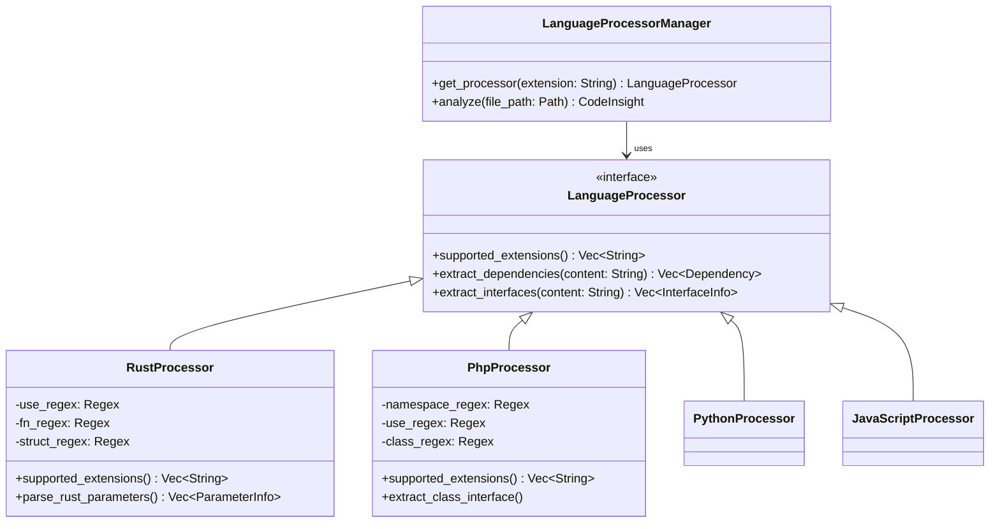

---

### 2. Ключевые структуры данных

Обработанная языковыми процессорами информация преобразуется в стандартизированные структуры данных, хранящиеся в оперативной памяти генератора [19, 20]:

*   **`Dependency` (Зависимость):** Описывает импорты и подключаемые модули. Содержит поля: `name` (название), `path` (путь), `is_external` (является ли внешней библиотекой), `dependency_type` (тип: "import", "use", "require" и т.д.) и `version` [21, 22].
*   **`InterfaceInfo` (Интерфейс):** Описывает публичные и приватные контракты кода. Содержит `name` (имя), `interface_type` (тип: "function", "method", "class", "trait"), `visibility` (видимость: "public", "private"), `parameters` (список параметров) и `return_type` (тип возвращаемого значения) [23].
*   **`ParameterInfo` (Параметр):** Описывает аргументы функций/методов. Включает `name`, `param_type`, и флаг `is_optional` [21].
*   **`CodeInsight` (Интеллектуальная сводка):** Общий контейнер для файла, который агрегирует базовое досье `CodeDossier`, список `dependencies`, список `interfaces` и метрики сложности `CodeComplexity` [24].

---

### 3. Алгоритм работы и Поток данных (Data Flow)

Процесс анализа исходного кода выполняется параллельно и асинхронно [25] в рамках агента `CodeAnalyze` (на этапе предварительной обработки `PREPROCESS`) [1, 26].

#### Пошаговый алгоритм извлечения данных:

1.  **Чтение исходного кода:** Система определяет целевой файл и считывает его содержимое в виде строки через утилиту `read_code_source`. Если файл слишком большой, применяется логика усечения `truncate_source_code` для экономии памяти [27].
2.  **Определение процессора:** `LanguageProcessorManager` извлекает расширение файла (например, `.php` или `.rs`) и находит соответствующий процессор в своем реестре. Если процессор не найден, глубокий лексический анализ пропускается [1, 4, 28].
3.  **Лексический парсинг (Regex):**
    *   Процессор построчно или блочно сканирует текст кода с помощью регулярных выражений.
    *   *Например (Rust):* Ищет совпадения по `use_regex` (`^\s*use\s+([^;]+);`) для поиска зависимостей и по `fn_regex` для поиска функций [14].
    *   *Например (PHP):* Извлекает `namespace` и ищет зависимости как через ключевые слова `use`, `require`, `include`, так и через комментарии Composer (`// composer: package/name`) [2, 29].
4.  **Разбор аргументов:** При обнаружении функции или метода захваченная группа регулярного выражения со списком параметров передается в специализированные методы (например, `parse_rust_parameters` [4], `parse_javascript_parameters` [3]), которые разбивают строку на отдельные `ParameterInfo`.
5.  **Формирование результата:** Извлеченные данные упаковываются во внутренние типы `Dependency` и `InterfaceInfo` [21, 23].
6.  **Сохранение в память:** Сгенерированный объект `CodeInsight` передается в `GeneratorContext` и сохраняется во внутреннюю In-Memory базу данных по ключу `ScopedKeys::CODE_INSIGHTS` для дальнейшего использования семантическим анализатором (`CodePurposeEnhancer`) [19, 20, 30].

#### Диаграмма последовательности (Sequence Diagram)

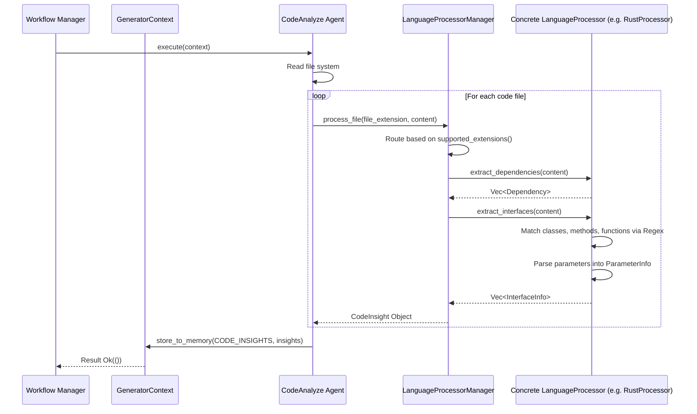

### Резюме реализации

Архитектура `Language Processor` в `code-tree-rs` сознательно жертвует полнотой компиляторного AST-парсера в пользу **мультиязычности, скорости работы и легковесности**. Используя строгие регулярные выражения для каждого поддерживаемого языка (например, обработка опциональных модификаторов `async`, `public`, `static` в регулярных выражениях [8-10, 14]), инструмент способен за минимальное время извлекать высокоуровневую архитектуру (публичный API, импорты компонентов) даже из сломанного или неполного кода.


#### 1.6 Feature: CodePurposeEnhancer


**Глубокий технический анализ подсистемы CodePurposeEnhancer**

### 1. Введение и Архитектурная роль

`CodePurposeEnhancer` (Улучшитель назначения кода) является интеллектуальным агентом этапа предварительной обработки (`preprocess`), который отвечает за семантическую классификацию компонентов исходного кода [1, 2]. В то время как лексические процессоры извлекают "что" находится в коде (функции, классы), `CodePurposeEnhancer` определяет "зачем" этот код нужен [1, 3].

Согласно архитектурной задумке, этот компонент объединяет строгие эвристические правила (rules) и интеллектуальный анализ (AI analysis) для точного определения бизнес-роли каждого файла (например, является ли он Контроллером, Моделью, Базой данных или UI-виджетом) [1].

### 2. Ключевые структуры данных

В основе работы агента лежат строго типизированные структуры для классификации:

**1. Перечисление `CodePurpose` (Назначение кода)**
Это ядро семантической типизации, представляющее собой Enum, покрывающий большинство паттернов проектирования и слоев архитектуры [4]. Основные категории:
*   **Архитектура MVC / Backend:** `Controller` (обработка логики), `Service` (бизнес-правила), `Dao` (доступ к данным), `Model` (модели данных), `Database` (базы данных), `Router` (маршрутизаторы), `Middleware` (промежуточное ПО) [4].
*   **Frontend / UI:** `Page` (страницы пользовательского интерфейса), `Widget` (UI-компоненты) [4].
*   **Инфраструктура и Утилиты:** `Config` (конфигурации), `Util` (низкоуровневые вспомогательные функции), `Tool` (инструменты), `Plugin` (плагины), `Test` (тесты), `Doc` (документация) [4].
*   **Специфичные:** `Entry` (точка входа), `Agent` (интеллектуальный агент), `Api` (интерфейсы вызовов RPC/HTTP) [4].
По умолчанию любому неклассифицированному компоненту присваивается тип `Other` [5].

**2. Структура `CodePurposeMapper`**
Отвечает за нормализацию и преобразование сырых текстовых строк (которые могут быть получены в результате парсинга комментариев или ответов AI) в строгий тип `CodePurpose` [5]. Метод `map_from_raw` приводит строку к нижнему регистру и удаляет все символы, кроме буквенно-цифровых ASCII, перед сопоставлением [5].

**3. Интеграция с досье `CodeDossier`**
Результат работы `CodePurposeEnhancer` сохраняется в поле `code_purpose` базовой структуры `CodeDossier`, которая входит в состав интеллектуальной сводки файла `CodeInsight` [6, 7].

---

### 3. Диаграмма классов (Class Diagram)

Ниже представлена архитектура классов и структур данных, задействованных в процессе семантического анализа.

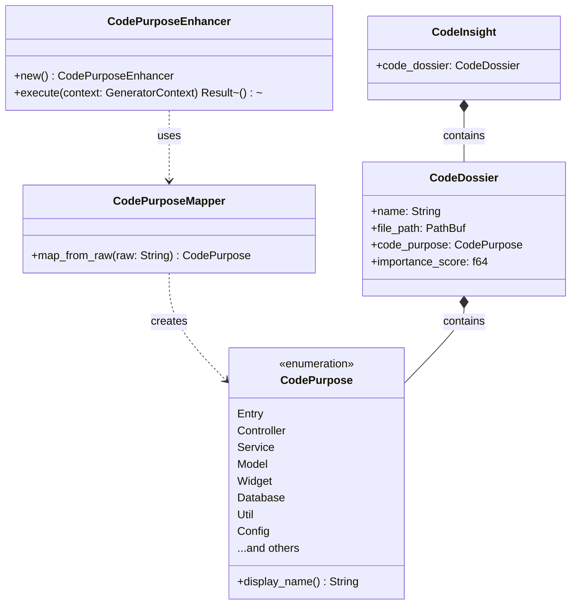

---

### 4. Поток данных (Data Flow) и Алгоритм работы

Жизненный цикл семантического обогащения интегрирован в глобальный `GeneratorContext` [1, 8]. Алгоритм работает следующим образом:

1.  **Чтение контекста:** Выполнение агента `CodePurposeEnhancer` начинается с доступа к оперативной памяти `Memory` через `GeneratorContext` [8]. Из памяти по ключу `ScopedKeys::CODE_INSIGHTS` извлекаются предварительно собранные лексическим анализатором сводки (`CodeInsight`) по всем файлам проекта [9].
2.  **Семантический анализ:** Для каждого `CodeInsight` агент анализирует доступные метаданные:
    *   Путь к файлу и его имя (например, `user_controller.rs` или `database/schema.sql`).
    *   Извлеченные интерфейсы и зависимости (например, наличие импортов `react` может указывать на `Widget` или `Page`) [7, 10].
    *   Анализ ИИ (согласно архитектуре, могут применяться эвристики или вызовы ИИ для нетривиальных файлов) [1].
3.  **Маппинг (Нормализация):** Полученный текстовый вывод (от правил или AI) передается в `CodePurposeMapper::map_from_raw(raw: &str)`. Алгоритм маппера фильтрует не-ASCII символы, приводит строку к нижнему регистру и сопоставляет с алиасами в `CodePurpose` (например, строка "Dependency library" или "package" будет преобразована в `CodePurpose::Lib`) [4, 5].
4.  **Обогащение структур:** Поле `code_purpose` внутри `CodeDossier` обновляется новым, классифицированным значением (заменяя дефолтное `Other`) [5, 6].
5.  **Сохранение результатов:** Обновленные объекты `CodeInsight` сериализуются и записываются обратно в `Memory` по тому же ключу (`CODE_INSIGHTS`), делая семантически обогащенные данные доступными для финальной генерации отчетов [8, 9].

---

### 5. Диаграмма последовательности (Sequence Diagram)

Диаграмма визуализирует асинхронный процесс классификации назначения кода:

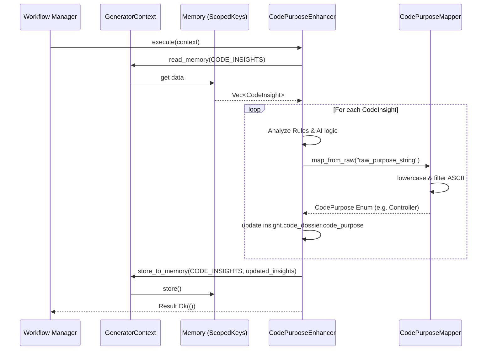


#### 1.7 Feature: Memory Architecture


Ниже представлен глубокий технический анализ **Архитектуры Памяти (Memory Architecture)** в проекте `code-tree-rs`.

### 1. Архитектурная роль и Концепция

Архитектура памяти в `code-tree-rs` спроектирована как **изолированное, потокобезопасное In-Memory хранилище (база данных в оперативной памяти)**. Ее главная задача — обеспечение безопасного обмена промежуточными данными между различными этапами (агентами) генерации, такими как извлечение структуры файлов, лексический и семантический анализ [1]. 

Так как приложение построено на асинхронном рантайме `tokio` и активно использует параллельные вычисления [2, 3], подсистема памяти инкапсулирует механизмы синхронизации (`RwLock`) и предоставляет строгую маршрутизацию данных через систему пространств имен (Scopes) и ключей (Keys) [4, 5].

---

### 2. Ключевые компоненты

#### 2.1. `GeneratorContext` (Контекст генератора)
Единая точка доступа к памяти. Память оборачивается в `Arc<RwLock<Memory>>`, что позволяет множеству асинхронных задач читать данные одновременно, либо эксклюзивно блокировать память для записи [4]. Контекст передается каждому генератору (через трейт `Generator`) [1].

#### 2.2. Система областей видимости (Scopes)
Чтобы избежать коллизий между модулями, память разделена на логические сегменты (пространства имен):
*   **`MemoryScope`**: Основное пространство для данных этапов пайплайна. Включает область `PREPROCESS` [5].
*   **`TimingScope`**: Изолированная область `TIMING`, используемая метриками `workflow` для хранения статистики времени выполнения этапов [6].

#### 2.3. Система ключей (Scoped Keys)
Внутри каждой области данные хранятся по строго определенным константным ключам:
*   **`ScopedKeys`**: Хранит бизнес-данные. Ключ `PROJECT_STRUCTURE` используется для сохранения собранной физической архитектуры проекта, а `CODE_INSIGHTS` — для массива глубокого анализа файлов (`CodeInsight`) [5].
*   **`TimingKeys`**: Хранит временные метрики, такие как `PREPROCESS` (время предварительной обработки) и `TOTAL_EXECUTION` (общее время выполнения генератора) [7].

---

### 3. Диаграмма классов (Class Diagram)

Диаграмма визуализирует структуру хранилища и связи между контекстом, блокировками и константами пространств имен.

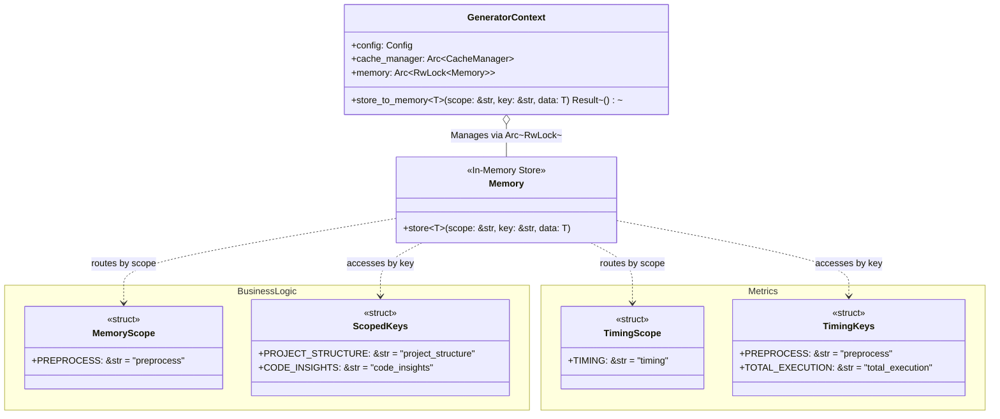

---

### 4. Ограничения типизации (Trait Bounds) и Структуры данных

Архитектура `Memory` накладывает строгие ограничения на типы данных, которые могут быть в нее помещены [4]:

Метод `store_to_memory<T>` требует, чтобы тип `T` реализовывал следующие трейты:
1.  **`Serialize`**: Данные должны поддерживать сериализацию (через `serde`). Это критически важно, так как память может сериализовывать значения (например, в JSON) для стандартизированного внутреннего хранения или последующего сброса в кэш.
2.  **`Send`**: Данные могут безопасно передаваться между потоками (необходимо для `tokio`).
3.  **`Sync`**: Ссылки на данные могут безопасно разделяться между потоками.

Типичными данными `T`, которые записываются в память, являются:
*   `Vec<CodeInsight>` (результаты `CodeAnalyze` и `CodePurposeEnhancer`) [8].
*   `ProjectStructure` (результаты `StructureExtractor`) [9].

---

### 5. Поток данных и Алгоритм записи (Data Flow)

Рассмотрим пошаговый алгоритм того, как агенты взаимодействуют с памятью при сохранении данных (на примере `store_to_memory`).

**Шаг 1. Инициация записи:** Агент (например, `StructureExtractor`) вызывает метод `context.store_to_memory` и передает область (`MemoryScope::PREPROCESS`), ключ (`ScopedKeys::PROJECT_STRUCTURE`) и сами данные `data` [4, 5].
**Шаг 2. Асинхронная блокировка:** Метод обращается к `self.memory.write().await`. Выполнение текущей задачи приостанавливается до тех пор, пока `tokio::sync::RwLock` не выдаст эксклюзивный (мутабельный) доступ к экземпляру `Memory` [4].
**Шаг 3. Делегирование и Сохранение:** Получив мутабельную ссылку, `GeneratorContext` вызывает внутренний метод `memory.store(scope, key, data)`. Данные сериализуются/сохраняются во внутренней хэш-таблице, привязанной к указанным scope и key [4].
**Шаг 4. Освобождение:** Блокировка `RwLock` автоматически снимается по выходу из области видимости, позволяя другим ожидающим агентам читать или писать данные.

#### Диаграмма последовательности (Sequence Diagram)

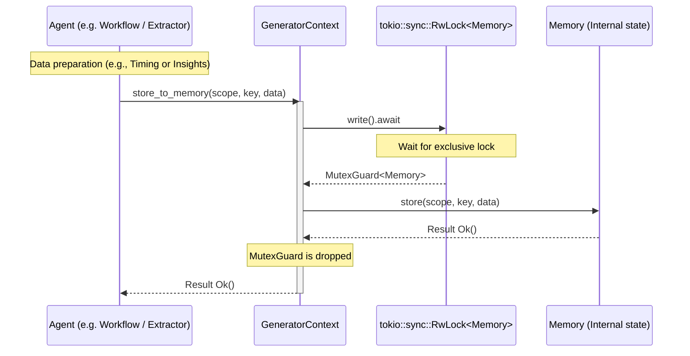

### Резюме

Архитектура памяти в `code-tree-rs` выступает в качестве высоконадежной внутренней шины данных. Использование `Arc<RwLock>` обеспечивает производительность (допуская множественные параллельные чтения при анализе), а жесткая система Scopes и Keys (`MemoryScope`, `TimingScope`) предотвращает конфликты ключей между логикой сборки кода и профилированием работы самого генератора [4-6]. Строгие ограничения трейтов (`Serialize + Send + Sync`) гарантируют, что данные могут быть корректно обработаны асинхронной средой `tokio` и интегрированы с системой кэширования [2, 4].


### Step 2 System Architecture investigation


Архитектура проекта `code-tree-rs` может быть логически разделена на несколько **Ограниченных контекстов (Bounded Contexts)** в соответствии с методологией предметно-ориентированного проектирования (DDD). Каждый контекст обладает строгими границами, собственной зоной ответственности и набором моделей данных.

Ниже представлены основные доменные границы проекта:

### 1. Контекст конфигурации и оркестрации (Configuration & Orchestration Context)
Отвечает за инициализацию приложения, сбор пользовательских настроек и управление жизненным циклом пайплайна генерации.
* **Основные функции:** Парсинг аргументов командной строки, загрузка параметров из файла (например, `.tree.toml`), определение списков игнорируемых директорий и файлов, а также глобальный хронометраж работы [1-4].
* **Ключевые компоненты:**
  * `cli::Args` — структура для приема аргументов пользователя [1].
  * `Config` и `CacheConfig` — агрегаты, хранящие итоговые параметры работы (пути, лимиты глубины, настройки кэша) [2, 3, 5].
  * `workflow::launch` — точка запуска и управления этапами, измеряющая время выполнения с помощью `TimingScope` и `TimingKeys` [4, 6].

### 2. Контекст файловой структуры (Physical Structure Context)
Занимается взаимодействием с файловой системой пользователя, сканированием директорий и созданием физической карты проекта.
* **Основные функции:** Обход файлового дерева, фильтрация бинарных и тестовых файлов, сбор статистики по размерам и типам файлов [7-9].
* **Ключевые компоненты:**
  * `StructureExtractor` — агент, извлекающий дерево [9].
  * Утилиты `file_utils` — функции `is_test_file`, `is_test_directory` и `is_binary_file_path` [7].
  * `ProjectStructure` — доменная модель, агрегирующая списки файлов (`files`), директорий (`directories`), типы файлов (`file_types`) и распределение размеров (`size_distribution`) [8].

### 3. Контекст лексического и синтаксического анализа (Lexical Analysis Context)
Отвечает за чтение исходного кода и извлечение из него "физических" контрактов (сигнатур) без глубокого понимания бизнес-логики. Это ядро мультиязычной поддержки проекта.
* **Основные функции:** Определение языка файла, применение регулярных выражений для поиска классов, функций, методов и импортов, а также парсинг аргументов [10-12].
* **Ключевые компоненты:**
  * `LanguageProcessorManager` — диспетчер, маршрутизирующий файлы на основе их расширений [10].
  * Абстракция `LanguageProcessor` и ее реализации (например, `PhpProcessor`, `RustProcessor`, `PythonProcessor`), которые используют предкомпилированные объекты `regex::Regex` [11-14].
  * Модели `Dependency`, `InterfaceInfo` и `ParameterInfo` [15, 16].

### 4. Контекст семантического анализа (Semantic Analysis Context)
Интеллектуальный слой, отвечающий за определение бизнес-предназначения каждого файла (ответ на вопрос "зачем нужен этот код?").
* **Основные функции:** Преобразование сырых данных лексического анализа в строгую архитектурную классификацию (MVC, инфраструктура, UI и т.д.) с помощью эвристик или ИИ [17].
* **Ключевые компоненты:**
  * `CodePurposeEnhancer` — интеллектуальный агент предварительной обработки [17].
  * `CodePurpose` — перечисление (Enum), определяющее такие роли, как `Controller`, `Model`, `Service`, `Widget`, `Database`, `Router` и другие [18, 19].
  * `CodePurposeMapper` — нормализатор, очищающий текстовый ввод (перевод в нижний регистр, удаление не-ASCII символов) для безопасного маппинга в `CodePurpose` [20].

### 5. Контекст управления состоянием (State & Memory Context)
Обеспечивает потокобезопасный обмен данными между всеми остальными контекстами в асинхронной среде. Действует как локальная in-memory база данных.
* **Основные функции:** Разделение данных по логическим областям видимости, безопасное конкурентное чтение/запись, интеграция с дисковым кэшем для ускорения повторных запусков [21, 22].
* **Ключевые компоненты:**
  * `GeneratorContext` — фасад, объединяющий конфигурацию (`Config`), менеджер кэша (`CacheManager`) и саму память (`Memory`) [21].
  * `MemoryScope` и `ScopedKeys` — строгие константы пространств имен (например, `PREPROCESS`, `PROJECT_STRUCTURE`, `CODE_INSIGHTS`), предотвращающие коллизии при сохранении [22].

### 6. Ядро доменных моделей (Core Domain Context)
Центральный контракт данных, вокруг которого строятся все остальные контексты (Shared Kernel). Эти структуры сериализуются и десериализуются на различных этапах пайплайна.
* **Основные модели:**
  * `CodeInsight` — корневой агрегат аналитики для конкретного файла, объединяющий досье, интерфейсы, зависимости и метрики сложности [23].
  * `CodeDossier` — базовая структура с именем, путем, сводкой и семантическим назначением кода (`CodePurpose`) [24].


На основе исходного кода и графа импортов проекта `code-tree-rs`, ниже представлена архитектурная карта модулей и пакетов уровня компонентов (C4 Уровень 3: Component Diagram). Этот уровень раскрывает внутреннюю структуру приложения, показывая, как контейнер (само приложение) разбит на логические модули и как они взаимодействуют друг с другом.

### Карта зависимостей модулей (Mermaid Диаграмма)

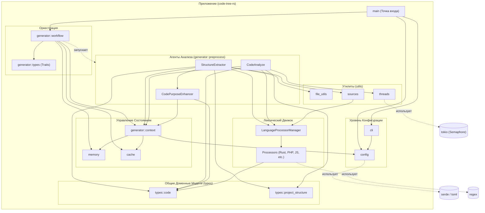

---

### Детализация модулей и их зависимостей

#### 1. Точка входа и Конфигурация (Entry & Config)
*   **`main`**: Связующее звено всего приложения. Парсит аргументы через `cli::Args`, инициализирует `config` и передает управление в `generator::workflow` [1].
*   **`cli`**: Модуль обработки параметров командной строки. **Зависит от:** `config` (преобразует аргументы CLI во внутреннюю структуру конфигурации `to_config()`) [2].
*   **`config`**: Независимый от бизнес-логики модуль управления настройками. Отвечает за парсинг файлов конфигурации (например, `.tree.toml`). **Зависит от:** внешних библиотек (например, `serde`, `std::fs`) [3, 4].

#### 2. Состояние и Память (State & Memory)
*   **`generator::context`**: Единый фасад для обмена данными (инкапсулирует конфигурацию, кэш и память). **Зависит от:** `config`, `cache::CacheManager`, `memory::Memory` [5]. Этот модуль импортируется практически всеми агентами приложения [6-9].
*   **`memory`**: Определяет ключи пространств имен `MemoryScope` и `ScopedKeys` [10]. Выступает в роли In-Memory хранилища, доступ к которому осуществляется через `context`.

#### 3. Оркестрация (Orchestration)
*   **`generator::workflow`**: Главный контроллер процесса генерации. Управляет хронометражом этапов (используя `TimingScope`). **Зависит от:** `config`, `cache`, `generator::context`, `generator::types::Generator` и агентов из `generator::preprocess` [11].

#### 4. Агенты Предварительной Обработки (Agents)
Ядро логики, реализующее извлечение данных. Каждый агент работает с `GeneratorContext` [9].
*   **`StructureExtractor`**: Сканирует файловую систему. **Зависит от:** `types::project_structure`, `types::code`, `utils::file_utils`, `utils::sources`, `CodePurposeEnhancer` (для маппинга) и `LanguageProcessorManager` [8].
*   **`CodeAnalyze`**: Отвечает за координацию разбора кода. **Зависит от:** `LanguageProcessorManager` (для парсинга файлов), `types::code` (создание `CodeInsight`), `utils::threads` (для контроля конкурентности через семафоры) [6].
*   **`CodePurposeEnhancer`**: Семантически классифицирует код. **Зависит от:** `types::code::{CodePurpose, CodePurposeMapper}` [7].

#### 5. Лексический Движок (Lexical Engine)
*   **`LanguageProcessorManager`**: Менеджер, управляющий конкретными языковыми парсерами [6, 8].
*   **Языковые процессоры (`rust`, `php`, `python`, `javascript` и др.)**: Опираются на регулярные выражения (`Regex`). **Зависят от:** Общих структур из ядра моделей — `Dependency`, `InterfaceInfo` и `ParameterInfo` из пакета `types::code` [12-19].

#### 6. Доменные Модели (Domain Types)
Центральный контракт (Shared Kernel) всего проекта, не имеет внутренних зависимостей от других бизнес-модулей.
*   **`types::code`**: Содержит структуры `CodeDossier`, `CodeInsight`, `CodePurpose`, `Dependency`, `InterfaceInfo` и метрики [20-23].
*   **`types::project_structure`**: Содержит `ProjectStructure`, `DirectoryInfo` и `FileInfo` [24].

#### 7. Утилиты (Utilities)
*   **`utils::file_utils`**: Независимый модуль с функциями (например, `is_test_file`, `is_binary_file_path`) [25].
*   **`utils::threads`**: Независимый модуль для параллельного выполнения задач с лимитом через `tokio::sync::Semaphore` [26].
*   **`utils::sources`**: Модуль для чтения исходников. **Зависит от:** `LanguageProcessorManager` (для возможной фильтрации или усечения) [27].


Ниже представлен глоссарий предметной области (Domain Language Glossary) проекта **code-tree-rs**, описывающий ключевые сущности, их назначение и взаимосвязи.

### 1. Основные доменные модели (Core Domain Models)

Эти сущности описывают структуру проекта и результаты интеллектуального анализа исходного кода.

*   **`ProjectStructure` (Структура проекта):** Описывает физическую архитектуру анализируемого проекта. Содержит корневой путь, списки директорий и файлов (`directories`, `files`), общее количество файлов и папок, а также статистику распределения по типам файлов и их размерам [1].
*   **`CodeInsight` (Интеллектуальная сводка):** Корневой агрегат (Aggregate Root) для каждого проанализированного файла кода. Он объединяет всю собранную информацию: базовое досье (`code_dossier`), списки интерфейсов (`interfaces`), зависимости (`dependencies`) и метрики сложности (`complexity_metrics`) [2].
*   **`CodeDossier` (Досье кода):** Базовая информация о конкретном файле. Включает его имя, физический путь (`file_path`), текстовое описание/сводку исходного кода, логическое назначение (`code_purpose`) и вычисленную оценку важности (`importance_score`) [3].
*   **`CodePurpose` (Назначение кода):** Перечисление (Enum), определяющее семантическую (бизнес) роль компонента. Включает такие типы, как `Controller`, `Model`, `Service`, `Widget`, `Database`, `Router`, `Test`, `Entry` и другие [4, 5].
*   **`Dependency` (Зависимость):** Описывает импортируемые или подключаемые модули в коде. Содержит имя, путь, тип зависимости (например, "import", "use", "require"), версию и флаг, указывающий, является ли зависимость внешней библиотекой (`is_external`) [6].
*   **`InterfaceInfo` (Интерфейс):** Описывает публичные и приватные контракты кода (классы, функции, методы, трейты). Включает имя, тип интерфейса, модификатор видимости (public/private), тип возвращаемого значения и список параметров [7].
*   **`ParameterInfo` (Параметр):** Описывает аргументы функций или методов, входящих в `InterfaceInfo`. Содержит имя, тип аргумента и флаг опциональности (`is_optional`) [6].
*   **`CodeComplexity` (Сложность кода):** Набор метрик для компонента, включая цикломатическую сложность, количество строк кода (lines of code), количество функций и классов [8].

---

### 2. Агенты и Механизмы анализа (Analysis Agents & Engines)

Сущности, отвечающие за сбор, парсинг и классификацию данных.

*   **`StructureExtractor` (Извлекатель структуры):** Агент, ответственный за сканирование файловой системы и формирование объекта `ProjectStructure`. Он фильтрует бинарные файлы и тестовые директории [9].
*   **`CodeAnalyze` (Анализатор кода):** Агент, координирующий глубокий лексический разбор файлов с использованием пула языковых процессоров для формирования `CodeInsight` [10].
*   **`CodePurposeEnhancer` (Улучшитель назначения):** Интеллектуальный агент, который комбинирует эвристические правила и AI-анализ для присвоения файлам точного значения `CodePurpose` (например, распознавание файла как контроллера) [9, 11].
*   **`LanguageProcessorManager` (Менеджер языковых процессоров):** Диспетчер, маршрутизирующий исходный код в соответствующий парсер на основе расширения файла [10].
*   **`LanguageProcessor` (Языковой процессор):** Базовый интерфейс (трейт) для парсеров конкретных языков (например, `RustProcessor`, `PhpProcessor`, `JavaScriptProcessor`). Они используют регулярные выражения (`Regex`) для извлечения `Dependency` и `InterfaceInfo` [12-15].

---

### 3. Состояние и Оркестрация (State & Orchestration)

Сущности, управляющие конфигурацией, жизненным циклом и хранением данных в процессе выполнения.

*   **`GeneratorContext` (Контекст генератора):** Единый фасад, который передается всем агентам (реализующим трейт `Generator` [16]). Содержит конфигурацию (`Config`), доступ к менеджеру кэширования (`CacheManager`) и потокобезопасный доступ к оперативной памяти (`Memory`) [17].
*   **`Memory` (Оперативная память):** Изолированное in-memory хранилище для безопасного обмена данными между потоками. Данные сохраняются по строго заданным ключам пространств имен [17, 18].
*   **`MemoryScope` и `ScopedKeys`:** Константы, задающие строгую маршрутизацию данных в памяти. Например, физическая структура проекта сохраняется по ключу `PROJECT_STRUCTURE`, а результаты парсинга кода — по ключу `CODE_INSIGHTS` в области видимости `PREPROCESS` [18].
*   **`TimingScope` и `TimingKeys`:** Отдельное пространство имен в памяти для хранения метрик времени выполнения различных этапов (например, `PREPROCESS` и `TOTAL_EXECUTION`) [19, 20].
*   **`Workflow` (Рабочий процесс):** Жизненный цикл программы (точка запуска `launch`), который координирует последовательный или параллельный запуск генераторов и отслеживает время их выполнения [19, 20].

---

### 4. Взаимосвязи между сущностями (Relationships)

*   **Отношение "Проект -> Архитектура":** В рамках одного запуска создается один агрегат `ProjectStructure`, описывающий физическую карту файлов [1, 9].
*   **Отношение "Проект -> Аналитика":** Проект генерирует массив объектов `CodeInsight` (по одному на каждый проанализированный файл исходного кода) [2].
*   **Композиция `CodeInsight`:** Один `CodeInsight` *содержит* ровно один `CodeDossier`, ровно одну структуру `CodeComplexity`, а также *множество* (от 0 до N) `Dependency` и `InterfaceInfo` [2].
*   **Композиция `InterfaceInfo`:** Каждый `InterfaceInfo` может содержать *множество* `ParameterInfo` (аргументов) [7].
*   **Связь Досье и Семантики:** В каждом `CodeDossier` строго определено одно значение `CodePurpose` [3]. Для приведения сырых строк к этому типу используется утилита `CodePurposeMapper` [21].
*   **Отношение "Контекст -> Компоненты":** `GeneratorContext` владеет ссылками (`Arc`) на `Config`, `CacheManager` и `Memory`. Он выступает посредником, когда агентам нужно сохранить извлеченные `CodeInsight` или `ProjectStructure` в `Memory` с помощью метода `store_to_memory` [16, 17].


Ниже представлена **Диаграмма контекста системы (System Context Diagram — C4 Level 1)** для проекта `code-tree-rs`. Этот уровень абстракции показывает саму систему в центре и ее взаимодействие с внешними акторами (пользователями) и внешними системами (окружением).

### Диаграмма контекста системы (Mermaid)

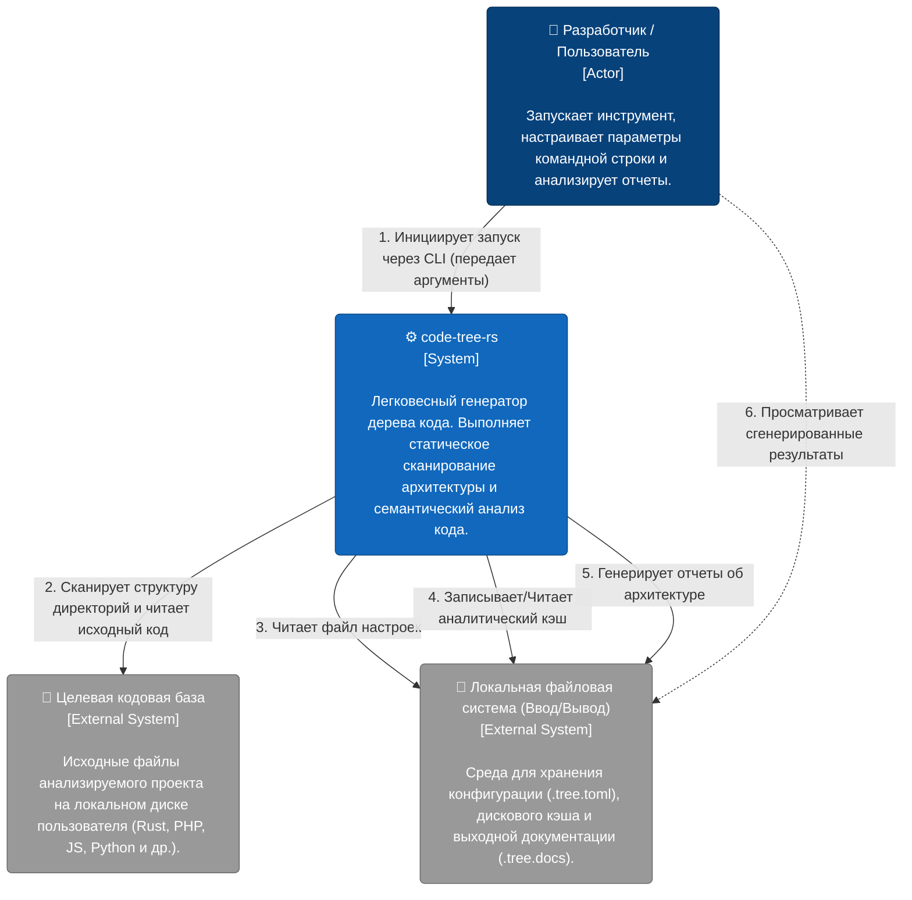

---

### Детальное описание компонентов (C4 L1 Breakdown)

В архитектуре контекста выделяются следующие основные роли и компоненты:

#### 1. Актор (External Actor)
*   **Разработчик (Developer):** Человек, использующий `code-tree-rs` для получения интеллектуальной сводки об архитектуре проекта. 
    *   **Взаимодействие:** Запускает инструмент через интерфейс командной строки (CLI), передавая параметры, такие как путь к проекту (`project_path`) [1]. После завершения работы инструмента разработчик читает сгенерированную документацию для лучшего понимания чужой или собственной кодовой базы.

#### 2. Анализируемая система (The System)
*   **`code-tree-rs`:** Главная система (контейнер). Представляет собой CLI-приложение, написанное на языке Rust [2]. 
    *   **Назначение:** Приложение предназначено для генерации дерева исходного кода и глубокого статического анализа архитектуры [2]. Оно извлекает физическую структуру директорий, читает код, распознает интерфейсы и зависимости [3], [4], а также классифицирует назначение компонентов (например, Controller, Service, Model) [5].

#### 3. Внешние системы (External Systems)
Инструмент тесно интегрирован с локальным окружением операционной системы, которое логически разделено на две сущности:

*   **Целевая кодовая база (Target Codebase):**
    *   Это директория с исходным кодом, на которую натравливается генератор. Система сканирует файлы, применяет языковые парсеры (для расширений `rs`, `php`, `js`, `py` и т.д.) [6], [7], [8] и считывает их содержимое в виде строк через утилиту `read_code_source` для дальнейшего разбора с помощью регулярных выражений [9]. При сканировании игнорируются системные папки (например, `node_modules`, `target`, `.git`) и бинарные файлы [10], [6].
*   **Файловая система: Конфигурация, Кэш и Вывод (File System I/O):**
    *   **Конфигурация:** Система обращается к файлу `.tree.toml` для загрузки глобальных настроек (лимиты глубины `max_depth`, размеры файлов `max_file_size`, пути исключений) [11], [12], [10].
    *   **Кэширование:** Для ускорения повторных запусков система использует дисковый кэш, по умолчанию сохраняемый в директории `.tree/cache` (определяется конфигурацией `cache_dir`) [11], [13].
    *   **Вывод (Output):** Итоговые результаты интеллектуального анализа и деревья проекта записываются обратно в файловую систему. По умолчанию для этого используется папка `.tree.docs` [11], [10].

### Пошаговый сценарий взаимодействия (System Workflow)

1.  **Старт:** Разработчик вызывает приложение `code-tree-rs` из терминала, опционально указывая путь к проекту (флаг `--project-path`) [1].
2.  **Инициализация:** Система пытается найти конфигурационный файл `.tree.toml` в корневой папке. Если файл найден, параметры загружаются и парсятся с помощью `serde` [2], [12]. В противном случае используются значения по умолчанию [10].
3.  **Сбор данных:** Система обращается к целевой кодовой базе. Она читает дерево файлов, фильтрует бинарники и тестовые папки [6], а затем загружает исходный код в память для лексического и семантического анализа [9], [14].
4.  **Работа с кэшем:** Во время работы `CacheManager` проверяет локальную папку `.tree/cache` [13]. Если файл кода не менялся с прошлого запуска, данные берутся из кэша, что экономит вычислительные ресурсы.
5.  **Финализация:** Проанализированные структуры данных (`CodeInsight`, `ProjectStructure`) компилируются в отчеты и сохраняются в директорию вывода `.tree.docs` [10], [4]. Разработчик получает доступ к готовой документации архитектуры.


Ниже представлена **Диаграмма контейнеров (Container Diagram — C4 Level 2)** для архитектуры инструмента `code-tree-rs`.

Поскольку `code-tree-rs` является монолитным CLI-приложением [1], в терминах методологии C4 «контейнерами» выступают его крупнейшие исполняемые подсистемы, встроенные хранилища данных и механизмы управления параллелизмом, а также внешняя файловая система, с которой взаимодействует инструмент.

### Диаграмма контейнеров (Mermaid)

```mermaid
flowchart TD
    %% Стили для C4
    classDef person fill:#08427b,stroke:#052e56,color:#fff,rx:5,ry:5;
    classDef container fill:#1168bd,stroke:#0b4884,color:#fff,rx:5,ry:5;
    classDef database fill:#1168bd,stroke:#0b4884,color:#fff,shape:cylinder;
    classDef external fill:#999999,stroke:#6b6b6b,color:#fff,rx:5,ry:5;

    %% Акторы
    User["👤 Разработчик\n[Пользователь]"]:::person

    %% Внешние системы
    FileSystem["📁 Локальная файловая система\n[Файлы: Исходный код, .tree.toml, .tree.docs]"]:::external

    %% Контейнеры внутри code-tree-rs
    subgraph CodeTreeRS ["⚙️ code-tree-rs (CLI Монолит)"]
        direction TB
        
        CLI["💻 Оркестратор и CLI\n[Контейнер: Rust / Tokio / Clap]\n\nПарсит аргументы, загружает конфиг и управляет жизненным циклом (workflow)."]:::container
        
        Engine["🧠 Аналитический движок (Агенты)\n[Контейнер: Rust / Regex]\n\nВыполняет сканирование структуры, лексический и семантический анализ (CodePurpose)."]:::container
        
        ThreadPool["⚙️ Пул задач и Семафоры\n[Контейнер: Tokio Semaphore]\n\nОграничивает количество конкурентных задач (замена традиционной очереди)."]:::container
        
        InMemoryStore[(🗄️ In-Memory DB\n[Контейнер: Arc RwLock Memory]\n\nХранит промежуточные данные (ProjectStructure, CodeInsights) и метрики тайминга.)]:::database
        
        DiskCache[(💾 Дисковый Кэш\n[Контейнер: CacheManager / Файлы]\n\nХранит сериализованные результаты предыдущих запусков в .tree/cache.)]:::database
    end

    %% Взаимодействия
    User -- "Запускает CLI с аргументами" --> CLI
    CLI -- "Загружает параметры (Config)" --> FileSystem
    CLI -- "Запускает генерацию" --> Engine
    
    Engine -- "Делегирует параллельные задачи" --> ThreadPool
    ThreadPool -- "Асинхронно читает код" --> FileSystem
    
    Engine -- "Читает / Пишет данные анализа\n(RwLock)" --> InMemoryStore
    Engine -- "Проверяет / Сохраняет кэш" --> DiskCache
    
    CLI -- "Генерирует финальные отчеты\n(.tree.docs)" --> FileSystem
    DiskCache -. "Сброс на диск" .-> FileSystem
```

---

### Детальное описание контейнеров (C4 L2 Breakdown)

#### 1. 💻 Оркестратор и CLI (CLI & Orchestrator)
*   **Технологии:** Rust, `clap` для парсинга аргументов [1, 2], `tokio` для асинхронного рантайма [3], `serde` и `toml` для конфигурации [1].
*   **Описание:** Это точка входа в систему (`main.rs`). Контейнер отвечает за прием пользовательских команд (`--project-path`) [2], загрузку конфигурационного файла `.tree.toml` из файловой системы [2, 4] и запуск глобального асинхронного процесса генерации (`workflow::launch`) [3, 5]. Оркестратор также отслеживает общее время выполнения и сохраняет метрики (`TOTAL_EXECUTION`) [5].

#### 2. 🧠 Аналитический движок (Analysis Engine / Agents)
*   **Технологии:** Rust, `regex` для синтаксического анализа [6-9], `futures` для асинхронных операций [6].
*   **Описание:** Ядро логики инструмента. Состоит из нескольких агентов этапа `PREPROCESS` [5]:
    *   **`StructureExtractor`:** Сканирует директории и собирает физическое дерево файлов проекта [10].
    *   **`CodeAnalyze`:** Управляет мультиязычным `LanguageProcessorManager` (содержащим парсеры для Rust, PHP, JS, Python и др.), извлекает интерфейсы, параметры и зависимости из кода с помощью регулярных выражений [8, 9, 11].
    *   **`CodePurposeEnhancer`:** Обогащает данные, выполняя семантический анализ (например, определяя, является ли файл Контроллером, Моделью или Базой данных) [12, 13].

#### 3. 🗄️ In-Memory DB (Управление состоянием)
*   **Технологии:** Rust, `Arc<RwLock<Memory>>` из `tokio` [14].
*   **Описание:** Внутренняя потокобезопасная база данных в оперативной памяти, инкапсулированная в `GeneratorContext` [14]. Поскольку инструмент работает параллельно, этот контейнер позволяет агентам безопасно обмениваться промежуточными данными (такими как `ProjectStructure` и массивы `CodeInsight`) без конфликтов [15]. Данные жестко разделены по областям видимости (`PREPROCESS`, `TIMING`) [15, 16].

#### 4. ⚙️ Пул задач и Семафоры (Контроль конкурентности / Очередь)
*   **Технологии:** `tokio::sync::Semaphore` [17], `futures::future::join_all` [17].
*   **Описание:** Инструмент не использует традиционные брокеры сообщений (такие как RabbitMQ или Kafka), так как это локальная утилита. Вместо этого роль системы управления очередями выполняет модуль `threads.rs` с функцией `do_parallel_with_limit`. Он использует семафоры для ограничения максимального количества одновременно выполняемых (concurrent) потоков при разборе файлов [17]. Лимит параллельных задач задается в конфигурации (`max_parallels: 10`) [18].

#### 5. 💾 Дисковый Кэш (Cache Manager)
*   **Технологии:** Rust, `serde_json` для сериализации/десериализации [1, 19].
*   **Описание:** Локальное хранилище данных, используемое для предотвращения повторного тяжелого парсинга неизмененных файлов. По умолчанию данные сохраняются в папку `.tree/cache` [18]. Включает в себя `CachePerformanceMonitor`, отслеживающий количество успешных записей (`cache_writes`) и ошибок (`cache_errors`) [20].

#### 6. 📁 Внешняя система: Локальная файловая система (Clients / File System)
*   **Технологии:** Стандартный ввод/вывод ОС.
*   **Описание:** Инструмент выступает "клиентом" по отношению к локальной файловой системе пользователя. Он активно читает исходный код (с фильтрацией бинарных и тестовых файлов по расширениям) [21, 22], а после успешного завершения всех этапов записывает сгенерированные сводки и документацию в выходную папку (по умолчанию `.tree.docs`) [21].


### Step 3 Runtime behavior investigation


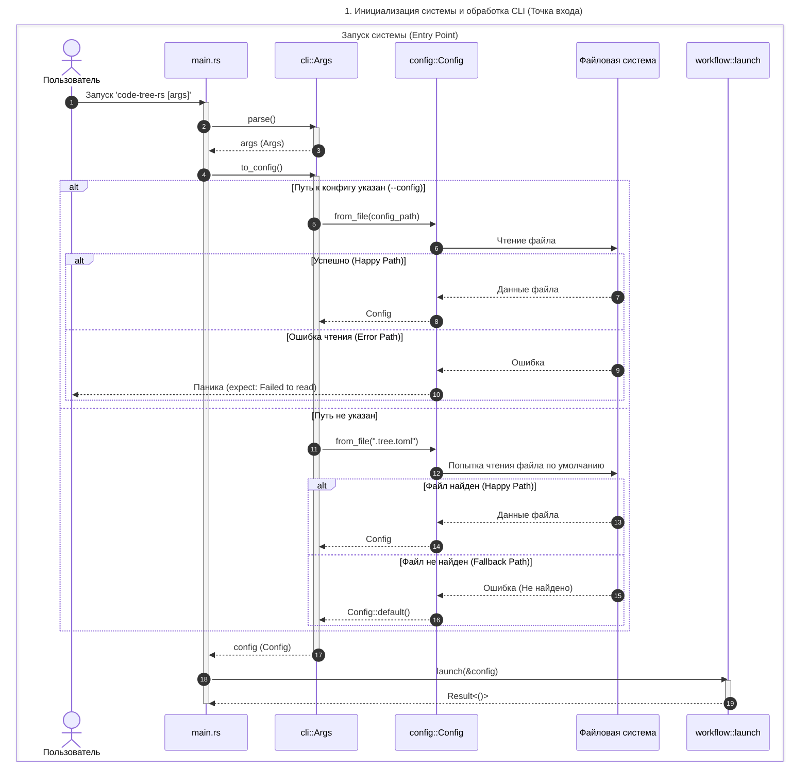

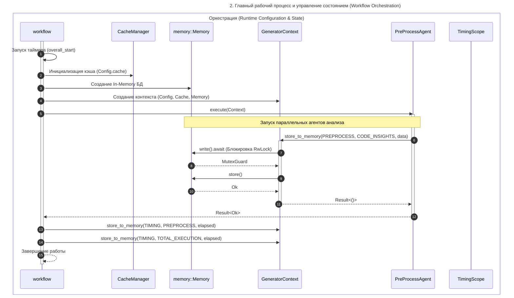

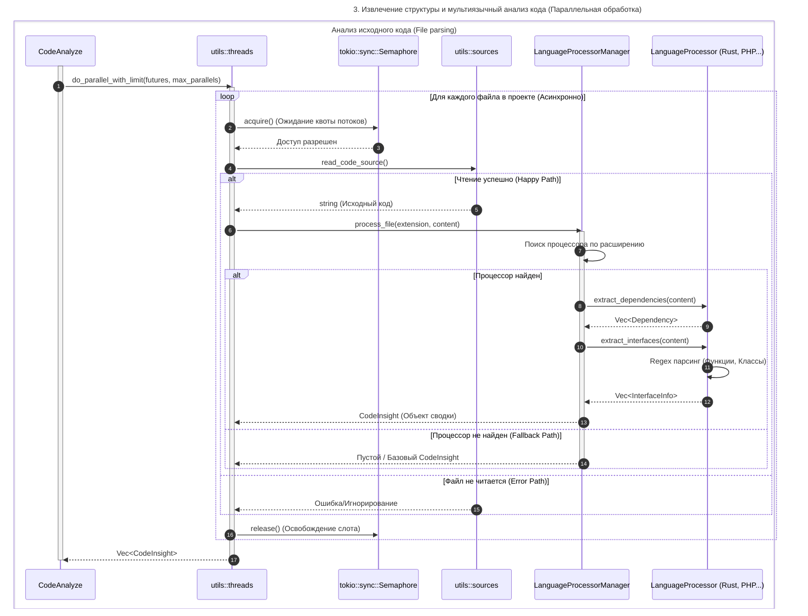

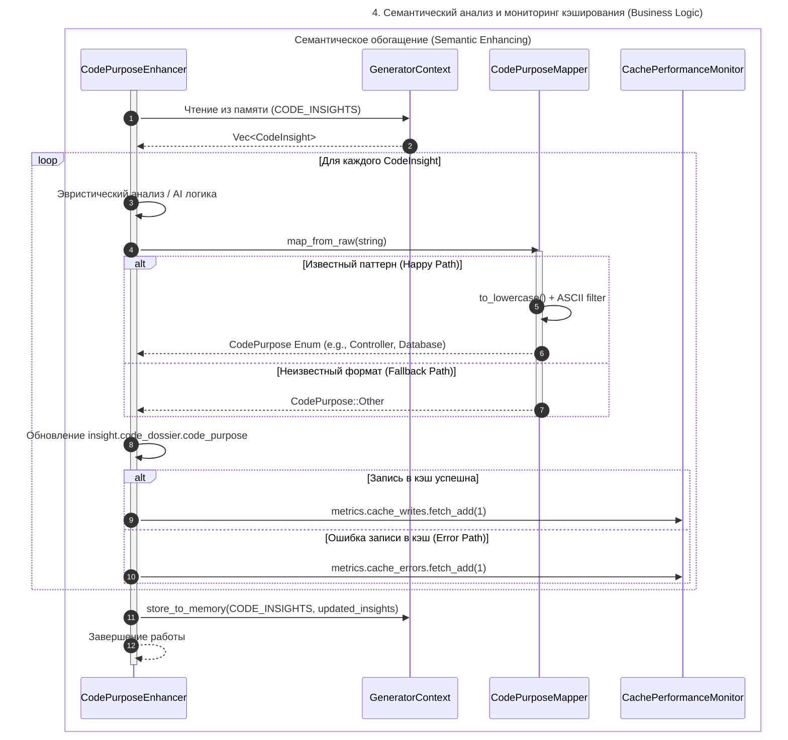


Ниже представлен детальный анализ жизненного цикла данных (Data Lifecycle) в проекте `code-tree-rs` — от их поступления до итоговой трансформации в выходную документацию. Отчет включает диаграммы потоков данных (DFD Уровня 0 и Уровня 1).

### Жизненный цикл данных (Data Lifecycle)

Процесс обработки данных в системе можно разделить на три ключевых этапа: **Ввод (Input)**, **Трансформация (Transformations)** и **Вывод (Output)**.

#### 1. Входные данные (Input Data)
*   **Аргументы командной строки (CLI):** Пользователь передает флаги запуска (например, `project_path`) при вызове `code-tree-rs` [1].
*   **Файл конфигурации (`.tree.toml`):** Содержит глобальные настройки, включая пути игнорируемых директорий (`excluded_dirs`), лимиты глубины (`max_depth`), параметры кэширования и путь вывода документации (`output_path`) [2-4].
*   **Локальная файловая система (Целевой проект):** Исходный код анализируемого проекта. Инструмент рекурсивно читает пути файлов и загружает текстовое содержимое (`read_code_source`) в память [5, 6].

#### 2. Трансформации (Transformations)
*   **Парсинг конфигурации (`cli::to_config`):** Система принимает параметры CLI и пытается прочитать файл конфигурации из указанного или дефолтного места, объединяя их в единый внутренний агрегат `Config` [1, 2].
*   **Извлечение структуры (Structure Extraction):** Агент `StructureExtractor` сканирует дерево файлов. В процессе он применяет фильтры (`is_test_file`, `is_binary_file_path`, списки исключений из конфига) и агрегирует статистику, формируя доменную модель `ProjectStructure` [3, 6-8].
*   **Лексический анализ (Lexical Parsing):** Агент `CodeAnalyze` распределяет исходный код по пулу языковых процессоров (например, `RustProcessor`, `PhpProcessor`) в зависимости от расширения файла [5-49]. Текстовые данные преобразуются в структурированные массивы с помощью регулярных выражений: извлекаются `Dependency` (импорты) и `InterfaceInfo` (функции, классы) [50, 51]. Формируется сырой объект `CodeInsight` [52].
*   **Семантическое обогащение (Semantic Enhancing):** Агент `CodePurposeEnhancer` анализирует сырые объекты `CodeInsight`. Интеллектуальный парсер `CodePurposeMapper` берет текстовую строку и очищает ее от не-ASCII символов, переводя в нижний регистр, после чего сопоставляет с перечислением `CodePurpose` (например, Controller, Dao, Widget) [53-55].
*   **Управление состоянием и кэшированием:** Все извлеченные и обогащенные объекты асинхронно сохраняются во внутреннюю In-Memory БД (`Arc<RwLock<Memory>>`) по строгим ключам (`CODE_INSIGHTS`, `PROJECT_STRUCTURE`) в пространстве имен `MemoryScope::PREPROCESS` [18, 56]. Для ускорения последующих запусков сериализованные данные сбрасываются в локальный дисковый кэш (управляется через `CacheManager`) [20, 56]. 

#### 3. Выходные данные (Output Data)
*   **Аналитический кэш:** Сериализованные результаты парсинга сохраняются в директорию кэша (по умолчанию `.tree/cache`), что экономит время при следующих запусках [3, 4].
*   **Итоговая архитектурная документация:** Собранные данные `ProjectStructure` и массив `CodeInsight` агрегируются и генерируются в виде готовой документации/дерева проекта в директории вывода (по умолчанию `.tree.docs`) [3]. Отслеживается общее время выполнения этапов, которое логируется по ключам `TimingKeys::TOTAL_EXECUTION` [57, 58].

---

### DFD L0: Контекстная диаграмма (Context Diagram)

Отображает систему как единый процесс, взаимодействующий с внешними акторами и хранилищами данных.

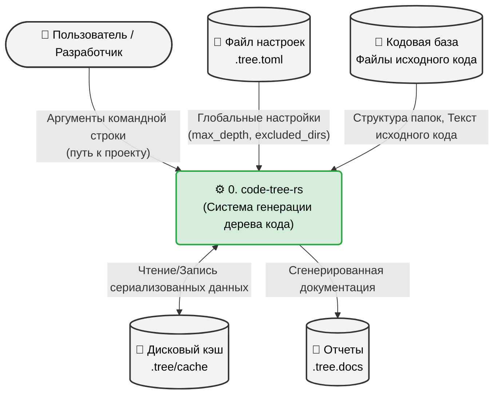

---

### DFD L1: Диаграмма потоков данных уровня системы

Показывает внутреннюю маршрутизацию данных, раскрывая детали трансформации сырого кода в аналитические модели через основные подсистемы (агенты).

```mermaid
flowchart TD
    %% Стилизация узлов
    classDef input fill:#e2e3e5,stroke:#383d41
    classDef store fill:#cce5ff,stroke:#b8daff,shape:cylinder
    classDef process fill:#d4edda,stroke:#28a745

    %% Внешние сущности (Ввод)
    Args([CLI Аргументы]):::input
    Toml([.tree.toml]):::input
    Codebase([Файлы проекта]):::input
    OutputReport([Сгенерированная\nдокументация]):::input

    %% Хранилища данных (Stores)
    MemStruct[(D1: In-Memory DB\nPROJECT_STRUCTURE)]:::store
    MemInsight[(D2: In-Memory DB\nCODE_INSIGHTS)]:::store
    DiskCache[(D3: Дисковый Кэш)]:::store

    %% Процессы (Transformations)
    P1("1.0 Загрузка конфигурации\n(cli::to_config)"):::process
    P2("2.0 Извлечение структуры\n(StructureExtractor)"):::process
    P3("3.0 Лексический анализ кода\n(CodeAnalyze / Regex)"):::process
    P4("4.0 Семантическое обогащение\n(CodePurposeEnhancer)"):::process
    P5("5.0 Генерация отчетов\n(Workflow)"):::process

    %% Потоки данных
    Args -->|Сырые флаги| P1
    Toml -->|Настройки парсинга| P1
    P1 -->|Объект Config| P2
    P1 -->|Объект Config| P3
    P1 -->|Объект Config| P5

    Codebase -->|Метаданные файлов| P2
    P2 -->|Объект ProjectStructure| MemStruct
    
    Codebase -->|Текст исходного кода (String)| P3
    P3 -->|Извлеченные InterfaceInfo\nи Dependency| MemInsight

    MemInsight -->|Сырой Vec<CodeInsight>| P4
    P4 -->|Маппинг в Enum CodePurpose| MemInsight

    MemInsight <-->|Чтение/Сброс состояния| DiskCache

    MemStruct -->|Структура проекта| P5
    MemInsight -->|Обогащенный Vec<CodeInsight>| P5
    
    P5 -->|Выходные артефакты| OutputReport
```


На основе анализа предоставленных исходных кодов проекта `code-tree-rs`, можно выделить три ключевые сущности, обладающие выраженным внутренним состоянием и жизненным циклом:

1.  **Рабочий процесс (Workflow)** — глобальный жизненный цикл оркестрации инструмента.
2.  **Интеллектуальная сводка файла (CodeInsight)** — процесс поэтапной трансформации исходного кода файла в глубокую аналитическую модель.
3.  **Семантический классификатор (CodePurpose)** — конечный автомат нормализации и приведения сырых текстовых данных к строгим доменным типам (Enum).

Ниже представлены диаграммы состояний (State Machine Diagrams) для каждой из этих сущностей с описанием их переходов на русском языке.

---

### 1. Жизненный цикл Рабочего процесса (Workflow Lifecycle)

Глобальный рабочий процесс (функция `launch`) управляет общим состоянием приложения от инициализации до финального сохранения метрик [1, 2].

```mermaid
stateDiagram-v2
    title Жизненный цикл Рабочего процесса (Workflow)
    
    [*] --> Initializing : Вызов launch(Config)
    
    Initializing --> ContextReady : Инициализация CacheManager,\nMemory (Arc<RwLock>) и GeneratorContext
    
    ContextReady --> Preprocessing : Запуск PreProcessAgent.execute(context)
    
    state Preprocessing {
        [*] --> ExtractingStructure : StructureExtractor
        ExtractingStructure --> AnalyzingCode : CodeAnalyze
        AnalyzingCode --> EnhancingPurpose : CodePurposeEnhancer
        EnhancingPurpose --> [*]
    }
    
    Preprocessing --> Profiling : Параллельные агенты завершили работу
    
    Profiling --> Completed : Сохранение метрик времени (TimingKeys::PREPROCESS,\nTimingKeys::TOTAL_EXECUTION) в Memory
    
    Completed --> [*] : Успешное завершение Result::Ok(())
```

**Описание состояний:**
*   **Initializing (Инициализация):** Инструмент запускает общий таймер (`Instant::now()`) и подготавливает базовые компоненты [1, 2].
*   **ContextReady (Контекст готов):** Создана In-Memory база данных и менеджер кэша. Инициализирован объект `GeneratorContext`, который будет передаваться всем агентам генерации [3].
*   **Preprocessing (Предварительная обработка):** Этап делегирования работы агентам. Включает извлечение структуры проекта, лексический анализ пулом языковых процессоров и семантическое обогащение [4-6].
*   **Profiling (Профилирование):** Подсчет времени, затраченного на анализ [1, 2].
*   **Completed (Завершено):** Финальные тайминги записаны в In-Memory БД по ключам области `TimingScope::TIMING`, процесс завершается [1, 2].

---

### 2. Жизненный цикл анализа файла (CodeInsight Processing)

Агрегат `CodeInsight` собирается поэтапно. Жизненный цикл конкретного файла зависит от квоты потоков выполнения и наличия нужных языковых парсеров [4, 7, 8].

```mermaid
stateDiagram-v2
    title Жизненный цикл анализа файла (CodeInsight)
    
    [*] --> Discovered : Файл найден в файловой системе\n(StructureExtractor)
    
    Discovered --> Pending : Добавлен в очередь задач
    Pending --> ReadingCode : Получен доступ к семафору\n(tokio::sync::Semaphore)
    
    ReadingCode --> LexicalParsing : Чтение успешно (String)\n(read_code_source)
    ReadingCode --> Skipped : Ошибка чтения / Игнорирование
    
    state LexicalParsing {
        [*] --> Routing : LanguageProcessorManager
        Routing --> RegexMatching : Найден процессор (например, RustProcessor)
        RegexMatching --> CodeInsightDraft : Извлечены InterfaceInfo и Dependency
        Routing --> Fallback : Процессор не найден\n(создан пустой CodeInsight)
        Fallback --> CodeInsightDraft
        CodeInsightDraft --> [*]
    }
    
    LexicalParsing --> SemanticEnhancing : Передача в CodePurposeEnhancer
    
    SemanticEnhancing --> StoredInMemory : Добавлено поле CodePurpose\n(Controller, Model, etc.)
    
    StoredInMemory --> Cached : Успешный сброс сериализованных данных на диск
    StoredInMemory --> [*] : Ошибка кэширования (игнорируется)
    Cached --> [*]
    Skipped --> [*]
```

**Описание состояний:**
*   **Pending (Ожидание):** Задача по анализу файла ждет освобождения слота в семафоре (`do_parallel_with_limit`), чтобы не перегрузить систему [8].
*   **ReadingCode (Чтение):** Код читается в строку, при необходимости обрезаясь утилитой `truncate_source_code` для защиты памяти [7].
*   **LexicalParsing (Лексический анализ):** Менеджер находит нужный процессор по расширению (например, `.rs`, `.php`, `.ts`) и применяет к коду регулярные выражения, формируя черновик `CodeInsight` (списки интерфейсов и импортов) [9-12].
*   **SemanticEnhancing (Семантическое обогащение):** Модель файла интеллектуально анализируется агентом `CodePurposeEnhancer` [5].
*   **StoredInMemory & Cached:** Итоговый полностью заполненный объект помещается в глобальную оперативную память `memory` и синхронизируется с дисковым кэшем [3].

---

### 3. Состояние маппинга предназначения кода (CodePurpose Mapper)

Перевод сырого текста (добытого лексическим процессором или AI-агентом) в строгий тип-перечисление (Enum) `CodePurpose` требует строгой нормализации [13, 14].

```mermaid
stateDiagram-v2
    title Нормализация логического назначения (CodePurposeMapper)
    
    [*] --> RawString : Входная сырая строка (raw)
    
    RawString --> Lowercased : to_lowercase()
    Lowercased --> AsciiFiltered : Фильтрация (оставляем только ASCII alphanumeric)
    AsciiFiltered --> Matching : Поиск совпадений по алиасам (serde alias)
    
    Matching --> Matched : Совпадение найдено
    Matching --> Unmatched : Совпадение не найдено
    
    Matched --> AssignedStrictEnum : Присвоение конкретного типа\n(CodePurpose::Controller, CodePurpose::Widget, и т.д.)
    Unmatched --> AssignedDefaultEnum : Присвоение типа по умолчанию\n(CodePurpose::Other)
    
    AssignedStrictEnum --> [*] : Возврат Enum
    AssignedDefaultEnum --> [*] : Возврат Enum
```

**Описание состояний:**
*   **RawString -> Lowercased -> AsciiFiltered:** Фаза очистки данных. Утилита `CodePurposeMapper::map_from_raw` приводит любой входящий текст в нижний регистр и удаляет все спецсимволы, оставляя только буквы и цифры английского алфавита для безопасного сравнения [14].
*   **Matching (Сопоставление):** Очищенная строка сопоставляется с алиасами в перечислении `CodePurpose` (например, строка "Dependency library" или алиас "package" приводит к `CodePurpose::Lib`) [13].
*   **Assigned (Назначение типа):** На основе результата маппинга объекту `CodeDossier` присваивается строгий тип, который затем используется при генерации итогового отчета [15]. Если тип не опознан, применяется резервное состояние `CodePurpose::Other` [14].


### Step 4 Subsystems investigation


### Core / Domain Layer


**Бизнес-проблема, которую решает Core / Domain Layer**

Ядро предметной области (Core / Domain Layer) проекта `code-tree-rs` расположено в модуле `types` и предоставляет **единую, не зависящую от языка программирования абстракцию архитектуры программного обеспечения**. 

Основная бизнес-проблема, которую решает этот слой — стандартизация гетерогенных данных. Исходный код на разных языках (Rust, PHP, Python, JS и др.) имеет разные синтаксические правила импорта, объявления классов и структур [1-5]. Доменный слой приводит этот "хаос" к строгим типизированным структурам [6-9]. Это позволяет:
1. Унифицировать документацию: генерировать стандартизированные отчеты (деревья) независимо от анализируемого стека.
2. Обеспечить отказоустойчивость: благодаря специальным механизмам "мягкой" десериализации, система может переваривать неточные или сырые данные (например, полученные от AI или из поврежденного кэша) без падения [10-12].
3. Семантически классифицировать код: преобразовать физические файлы в понятные бизнес-категории (например, Контроллеры, Сервисы, Утилиты) [13, 14].

---

### Внутренняя структура: Модули и сущности (Entities)

Доменный слой жестко разделен на физическую структуру проекта (`ProjectStructure`) и интеллектуальную сводку по конкретным файлам (`CodeInsight`).

| Сущность (Модель) | Модуль | Описание и бизнес-роль |
| :--- | :--- | :--- |
| **`ProjectStructure`** | `types::project_structure` | Корневая сущность физической архитектуры. Агрегирует списки всех директорий и файлов, общее их количество, а также распределение по типам файлов и размерам [15]. |
| **`CodeInsight`** | `types::code` | Корневой агрегат (Aggregate Root) логической архитектуры одного файла. Объединяет досье, интерфейсы, зависимости и метрики [7]. |
| **`CodeDossier`** | `types::code` | Базовая карточка файла. Содержит путь, назначение (`CodePurpose`), саммари кода и вычисленный `importance_score` [6]. |
| **`CodePurpose`** | `types::code` | Перечисление (Enum) семантических ролей. Включает: `Controller`, `Service`, `Model`, `Widget`, `Database`, `Api`, `Config`, `Test` и другие [13]. Если назначение не определено, используется `Other` [16]. |
| **`InterfaceInfo`** | `types::code` | Абстракция контракта (функции, метода, класса, трейта). Содержит имя, тип интерфейса, модификатор видимости (public/private), параметры и тип возвращаемого значения [8]. |
| **`ParameterInfo`** | `types::code` | Аргумент функции/метода, входящего в `InterfaceInfo`. Содержит имя, тип и флаг опциональности (`is_optional`) [9]. |
| **`Dependency`** | `types::code` | Абстракция зависимости (импорта). Содержит путь, тип (import, use, require), и флаг внешней библиотеки (`is_external`) [9]. |
| **`CodeComplexity`** | `types::code` | Базовые метрики файла: цикломатическая сложность, количество строк кода (LOC), количество функций и классов [17]. |

---

### Диаграмма классов доменного слоя (UML Class Diagram)

Ниже представлена структура связей между сущностями (композиция и агрегация).

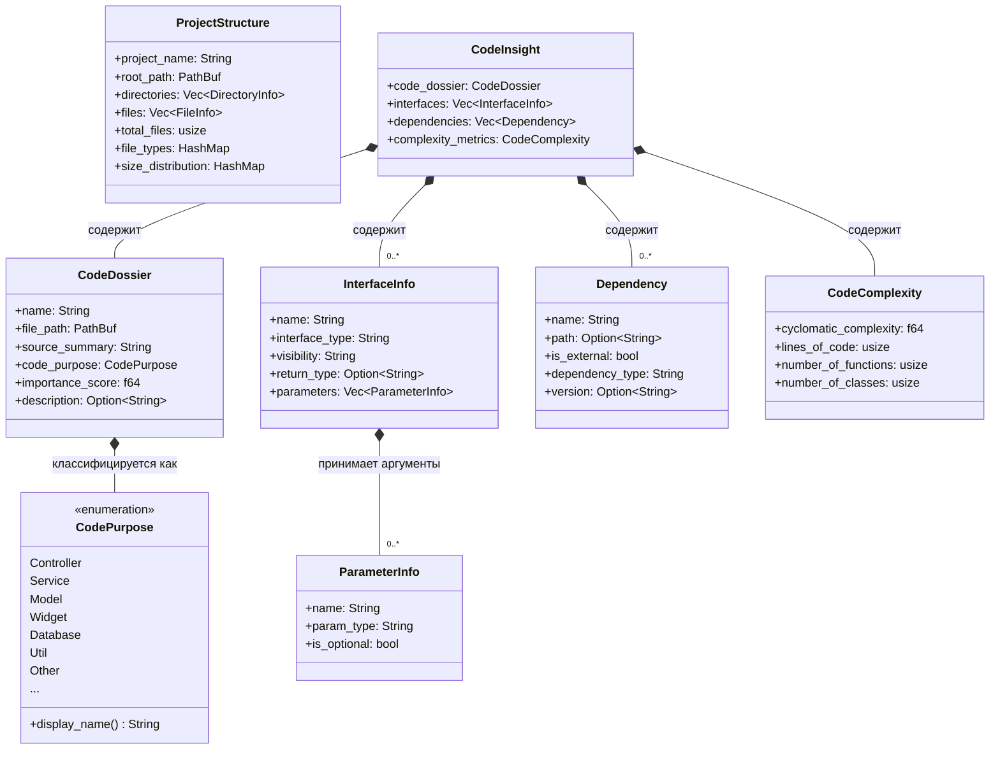

---

### Поведение и методы (Behavior & Functions)

Несмотря на то, что доменная модель по большей части анемична (состоит из структур данных, сериализуемых через `serde` [6, 10]), она содержит критически важную логику обеспечения целостности данных (Data Integrity) и маппинга.

| Функция / Метод | Принадлежность | Поведение и логика |
| :--- | :--- | :--- |
| **`deserialize_*_lenient`** | Вспомогательные функции (`code.rs`) | Серия кастомных функций для `serde` (`deserialize_string_lenient`, `deserialize_interfaces_lenient` и др.). Они извлекают строки даже из вложенных JSON-объектов (ища ключи "name", "value", "text") или преобразуют числа/булевы значения в строки [10-12]. Защищают систему от падений при парсинге некорректно сформированных данных. |
| **`map_from_raw`** | `CodePurposeMapper` | Бизнес-правило нормализации. Принимает сырую строку (например, из комментариев или AI), переводит в нижний регистр, отфильтровывает все не-ASCII символы и сопоставляет с алиасами (через `serde(alias)`) перечисления `CodePurpose` [16]. |
| **`display_name`** | `CodePurpose` | Инкапсулирует человекочитаемые названия ролей (например, `CodePurpose::Entry` -> "Project Execution Entry", `CodePurpose::Widget` -> "Frontend UI Component") [14]. |
| **`fmt` (Display)**| `Dependency` | Преобразует объект зависимости в удобную строку вида `(name=..., path=..., is_external=...,dependency_type=...)` для логирования и отчетов [17]. |

---

### Диаграмма поведения: Маппинг назначения кода (Behavior Sequence)

Диаграмма ниже демонстрирует, как поведение доменного слоя (`CodePurposeMapper` и `CodePurpose`) преобразует неструктурированный текст в строгую бизнес-сущность в момент десериализации или программного вызова.

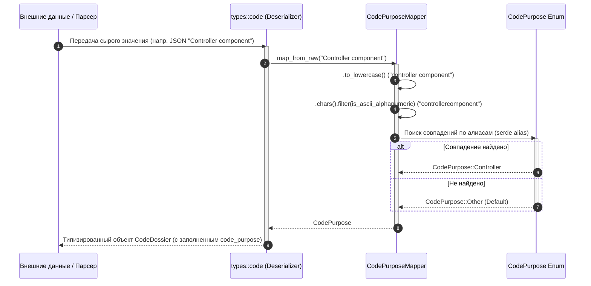


**Жизненный цикл (Lifecycle) слоя Core / Domain**

Жизненный цикл бизнес-сущностей в ядре `code-tree-rs` управляется централизованным рабочим процессом (Workflow) и инкапсулирован в потокобезопасный `GeneratorContext` [1, 2]. Жизненный цикл можно разделить на следующие фазы:

1. **Инициализация:** При запуске приложения `main.rs` инициализирует конфигурацию через CLI или конфигурационный файл и передает ее в `workflow::launch` [2-4]. Создается общий `GeneratorContext`, включающий конфигурацию, менеджер кэша и In-Memory БД (`Arc<RwLock<Memory>>`) [1].
2. **Предварительная обработка (Preprocess):** Параллельно запускаются агенты (например, `StructureExtractor`, языковые парсеры в `CodeAnalyze`), которые генерируют доменные модели (объекты `ProjectStructure` и массивы `CodeInsight`) [2, 5, 6].
3. **Сохранение состояния (Store to Memory):** По мере генерации, агенты обращаются к `GeneratorContext::store_to_memory`, блокируя память на запись (`RwLock::write()`) и сохраняя типизированные модели по строгим ключам (например, `ScopedKeys::CODE_INSIGHTS` в области `MemoryScope::PREPROCESS`) [1, 7].
4. **Профилирование и финализация:** После завершения всех задач рабочий процесс сохраняет метрики времени (например, `TimingKeys::PREPROCESS` и `TimingKeys::TOTAL_EXECUTION`) в выделенную область памяти `TimingScope::TIMING` [2, 8].

```mermaid
sequenceDiagram
    autonumber
    participant CLI
    participant Config as config.rs
    participant Workflow as workflow.rs
    participant Context as GeneratorContext
    participant Agents as Agents (Extractors)
    participant Memory as RwLock<Memory>

    CLI->>Config: Парсинг аргументов и .tree.toml
    Config-->>Workflow: Объект Config
    Workflow->>Workflow: Запуск таймера (Instant::now)
    Workflow->>Context: Инициализация (Config, Cache, Memory)
    Workflow->>Agents: execute(Context)
    
    activate Agents
    Agents->>Agents: Генерация доменных моделей (ProjectStructure, CodeInsight)
    Agents->>Context: store_to_memory(scope, key, data)
    Context->>Memory: write().await
    Memory-->>Context: MutexGuard
    Context->>Memory: store(data)
    Context-->>Agents: Result<()>
    Agents-->>Workflow: Result<()>
    deactivate Agents
    
    Workflow->>Context: Сохранение метрик времени (TimingKeys)
```

---

**Конфигурация: параметры, переменные окружения, значения по умолчанию**

Конфигурация приложения управляется модулем `config.rs` и парсится из файла (по умолчанию `.tree.toml`), дополняясь аргументами командной строки [3, 9, 10]. 

*Переменные окружения:* Явного связывания параметров с переменными окружения (environment variables) в бизнес-логике нет. Единственное использование системного окружения — вызов `std::env::current_dir()` для определения текущей рабочей директории, если путь к проекту не передан явно [3].

**Таблица параметров конфигурации (`Config` и `CacheConfig`)** [10-12]:

| Группа | Параметр | Описание | Значение по умолчанию |
| :--- | :--- | :--- | :--- |
| **Базовые** | `project_path` | Корневой путь анализируемого проекта. | `"."` (текущая директория) [10] |
| | `project_name` | Название проекта (опционально). | `None` [10] |
| | `output_path` | Путь для сохранения сгенерированной документации. | `"./tree.docs"` [10] |
| | `internal_path` | Путь для служебных файлов (кэш, временные данные). | `"./.tree"` [10] |
| **Сканирование** | `max_depth` | Максимальная глубина обхода директорий. | `10` [10] |
| | `max_file_size` | Лимит размера файла для чтения (в байтах). | `65536` (64KB) [10] |
| | `include_tests` | Включать ли тестовые файлы в анализ. | `false` [10] |
| | `include_hidden`| Включать ли скрытые файлы и папки (начинающиеся с точки).| `false` [10] |
| | `analyze_dependencies` | Включен ли глубокий анализ импортов. | `true` (из `.tree.toml`) [11] |
| | `identify_components` | Включен ли семантический анализ (CodePurpose). | `true` (из `.tree.toml`) [11] |
| **Фильтры** | `excluded_dirs` | Список игнорируемых директорий. | `node_modules`, `target`, `.git`, `build`, `venv`, `__pycache__` и др. [10] |
| | `excluded_files`| Список игнорируемых системных файлов и логов. | `.gitignore`, `Cargo.lock`, `package-lock.json`, `yarn.lock`, `*.log`, `.env` и др. [10] |
| | `excluded_extensions` | Список игнорируемых расширений (в основном бинарники). | `jpg`, `png`, `pdf`, `zip`, `exe`, `dll`, `mp4` и др. [10] |
| **Кэширование** | `cache.enabled` | Включено ли дисковое кэширование результатов парсинга. | `true` [12] |
| | `cache.cache_dir`| Директория хранения кэша файлов. | `".tree/cache"` [12] |
| | `cache.expire_hours`| Время жизни кэша (в часах). | `8760` (1 год) [12] |
| | `cache.max_parallels`| Максимальное количество параллельных задач (семафор). | `10` [12] |

---

**Каналы взаимодействия и основные партнеры (Interaction Channels & Partners)**

Доменный слой действует как ядро приложения, обеспечивая маршрутизацию данных между различными модулями (партнерами).

1. **Канал CLI и Файловой системы (Ввод/Вывод):**
   * *Модуль `cli`* получает сырой путь от пользователя (`--project-path`) и конвертирует его в инициализированный объект `Config`, считывая `.tree.toml` из файловой системы [3].
   * Агенты чтения (`utils::sources`) читают исходный код из файловой системы, преобразуя его в текст `String` для лексического анализа [13].
2. **Внутренний канал оркестрации (GeneratorContext):**
   * *Главный партнер*: In-Memory база данных (`Arc<RwLock<Memory>>`). Все агенты (например, `StructureExtractor`, `CodePurposeEnhancer`) общаются друг с другом асинхронно через этот объект [1, 6]. Агенты не передают данные напрямую друг другу — они сохраняют их в `Memory` по ключам `ScopedKeys`, откуда их могут прочитать последующие обработчики.
3. **Канал мультиязычных процессоров (Лексический движок):**
   * `CodeAnalyze` выступает связующим звеном. Он делегирует текстовый код парсерам, реализующим трейт `LanguageProcessor` (например, `RustProcessor`, `PhpProcessor`, `JavaScriptProcessor`), которые извлекают интерфейсы и зависимости [14-17].
4. **Канал Кэширования:**
   * Партнером выступает `CacheManager` и монитор производительности `CachePerformanceMonitor`, которые взаимодействуют с файловой системой (директория `cache_dir`), чтобы сериализовать и десериализовать объекты `CodeInsight`, минуя повторный парсинг кода [1, 12, 18].

```mermaid
flowchart TD
    classDef domain fill:#d4edda,stroke:#28a745,color:#000
    classDef input fill:#e2e3e5,stroke:#383d41,color:#000
    classDef store fill:#cce5ff,stroke:#b8daff,color:#000

    UserCLI(["💻 CLI (Пользователь)"]):::input
    FSConfig[("📄 Файл .tree.toml")]:::input
    FSCode[("📁 Исходный код проектов")]:::input
    
    subgraph CoreDomain ["Core / Domain Layer"]
        direction TB
        ConfigObj("⚙️ Модель Config"):::domain
        Context{"🔄 GeneratorContext (Канал обмена)"}:::domain
        MemoryStore[("🧠 In-Memory Data\n(CodeInsight, ProjectStructure)")]:::store
        LangProcessors("🧠 LanguageProcessors\n(Regex Parsing)"):::domain
    end
    
    FSCache[("💾 Дисковый Кэш (.tree/cache)")]:::store
    FSOutput[("📑 Выходные Отчеты (.tree.docs)")]:::store

    UserCLI -- "Аргументы" --> ConfigObj
    FSConfig -- "Парсинг toml" --> ConfigObj
    
    ConfigObj -- "Инициализация" --> Context
    
    FSCode -- "Чтение (utils::sources)" --> LangProcessors
    LangProcessors -- "Создание моделей" --> Context
    
    Context <-->|"Блокировка RwLock\nЧтение/Запись"| MemoryStore
    Context <-->|"Сброс на диск"| FSCache
    
    MemoryStore -- "Генерация" --> FSOutput
```


### Caching


**Бизнес-проблема, которую решает Кэширование (Caching)**

Подсистема кэширования в `code-tree-rs` решает проблему **избыточных ресурсоемких вычислений и долгого времени ожидания при повторных запусках**. 
Статический анализ включает в себя чтение исходного кода с диска, применение множества сложных регулярных выражений для каждого файла (в зависимости от языка программирования) и семантическую классификацию (определение `CodePurpose`). Сохраняя сериализованные результаты парсинга (объекты `CodeInsight`) в локальный дисковый кэш, система избегает повторного анализа тех файлов, которые не изменялись с момента последнего запуска. Это радикально ускоряет генерацию документации в больших кодовых базах [1].

---

### Внутренняя структура: Модули, Классы и Функции

Архитектура кэширования разделена на конфигурацию, управление чтением/записью на диск и мониторинг производительности.

| Модуль / Класс | Описание и Назначение | Ключевые поля и функции |
| :--- | :--- | :--- |
| **`config::CacheConfig`** | Модель конфигурации кэша, загружаемая из файла `.tree.toml` [2]. | `enabled: bool`, `cache_dir: PathBuf`, `expire_hours: u64`, `max_parallels: usize` [1]. |
| **`cache::CacheManager`** | Главный координатор дискового кэша. Инициализируется в рабочем процессе (`workflow.rs`) и передается агентам через `GeneratorContext` в виде потокобезопасного `Arc<CacheManager>` [3, 4]. | Отвечает за проверку валидности кэша (по времени жизни `expire_hours`), чтение сериализованных файлов и их запись. |
| **`cache::performance_monitor::CachePerformanceMonitor`** | Обертка для потокобезопасного отслеживания статистики работы кэша [5]. | Содержит поле `metrics: Arc<CacheMetrics>`. Функции: `new()`, `default()` [5]. |
| **`cache::performance_monitor::CacheMetrics`** | Структура, хранящая атомарные счетчики для телеметрии [5]. | `cache_writes: AtomicUsize` (успешные записи), `cache_errors: AtomicUsize` (ошибки записи) [5]. |
| **`generator::context::GeneratorContext`** | Фасад состояния, предоставляющий доступ к кэшу всем агентам пайплайна [3]. | Поле `cache_manager: Arc<CacheManager>` [3]. |

---

### Параметры конфигурации (Environment / Default Values)

Конфигурация кэша настраивается через секцию `[cache]` в файле `.tree.toml` [2, 6].

| Параметр в `.tree.toml` | Тип | Значение по умолчанию | Описание |
| :--- | :--- | :--- | :--- |
| `cache.enabled` | `bool` | `true` | Глобальный переключатель, активирующий дисковое кэширование [1]. |
| `cache.cache_dir` | `PathBuf` | `".tree/cache"` | Относительный или абсолютный путь к директории, где хранятся сериализованные файлы кэша (в формате JSON) [1, 6]. |
| `cache.expire_hours` | `u64` | `8760` | Время жизни кэша в часах. По умолчанию 8760 часов (ровно 1 год) [1, 6]. |
| `cache.max_parallels`| `usize` | `10` | Максимальное количество параллельных задач при чтении/записи (используется семафор `tokio`) [1, 7]. |

---

### Взаимосвязи и Архитектура (Диаграммы C4 / UML)

#### 1. Диаграмма классов (Class Diagram)
Диаграмма показывает отношения между конфигурацией, контекстом выполнения и подсистемой мониторинга кэша.

```mermaid
classDiagram
    direction TB

    class Config {
        +project_path: PathBuf
        +cache: CacheConfig
    }

    class CacheConfig {
        +enabled: bool
        +cache_dir: PathBuf
        +expire_hours: u64
        +max_parallels: usize
    }

    class GeneratorContext {
        +config: Config
        +cache_manager: Arc~CacheManager~
        +memory: Arc~RwLock~Memory~~
    }

    class CacheManager {
        <<Service>>
        -config: CacheConfig
        +get_cached_insight(file_path) Option~CodeInsight~
        +save_to_cache(file_path, insight) Result~()~
    }

    class CachePerformanceMonitor {
        -metrics: Arc~CacheMetrics~
        +new() CachePerformanceMonitor
    }

    class CacheMetrics {
        +cache_writes: AtomicUsize
        +cache_errors: AtomicUsize
    }

    Config *-- CacheConfig : содержит
    GeneratorContext o-- CacheManager : инкапсулирует через Arc
    GeneratorContext o-- Config : инкапсулирует
    CacheManager ..> CacheConfig : использует настройки
    CachePerformanceMonitor *-- CacheMetrics : управляет счетчиками
```

#### 2. Диаграмма поведения: Жизненный цикл чтения и записи кэша (Sequence Diagram)
Диаграмма иллюстрирует, как кэш интегрирован в процесс анализа кода (на примере агента `CodeAnalyze` и обогатителя `CodePurposeEnhancer`). Метрики обновляются с использованием атомарных операций потокобезопасного счетчика [5].

```mermaid
sequenceDiagram
    autonumber
    participant Workflow as workflow::launch
    participant Context as GeneratorContext
    participant Agent as Агенты (CodeAnalyze / Enhancer)
    participant CM as CacheManager
    participant FS as Диск (.tree/cache)
    participant Monitor as CachePerformanceMonitor (Metrics)

    Workflow->>CM: Инициализация (на основе CacheConfig)
    Workflow->>Context: Создание контекста с Arc<CacheManager>
    
    activate Agent
    Agent->>CM: Проверка кэша для file_path
    CM->>FS: Проверка времени изменения файла (expire_hours)
    
    alt Кэш валиден (Cache Hit)
        FS-->>CM: Сериализованные данные (JSON)
        CM-->>Agent: CodeInsight (Пропуск парсинга)
    else Кэш устарел / отсутствует (Cache Miss)
        CM-->>Agent: None
        Agent->>Agent: Чтение исходников, Regex парсинг (LanguageProcessor)
        Agent->>Agent: Семантическое обогащение (CodePurpose)
        
        Agent->>CM: Сохранение результатов в кэш
        CM->>FS: Запись сериализованного CodeInsight
        
        alt Запись успешна
            CM-->>Agent: Ok
            Agent->>Monitor: metrics.cache_writes.fetch_add(1, Ordering::SeqCst)
        else Ошибка записи
            CM-->>Agent: Error
            Agent->>Monitor: metrics.cache_errors.fetch_add(1, Ordering::SeqCst)
        end
    end
    deactivate Agent
```


**Бизнес-проблема, которую решает Кэширование (Caching)**

В контексте статического анализа кода `code-tree-rs` чтение тысяч файлов с диска и применение к ним множества сложных регулярных выражений (для извлечения AST-подобных структур, импортов, функций и классов) является крайне ресурсоемкой задачей. Подсистема кэширования решает проблему **избыточных повторных вычислений**. Сохраняя сериализованные результаты глубокого анализа (объекты `CodeInsight`) на диск, система при повторном запуске обходит неизмененные файлы, что радикально сокращает время генерации архитектурной документации [1, 2].

---

### Жизненный цикл (Lifecycle)

Жизненный цикл подсистемы кэширования тесно вплетен в процесс предварительной обработки кода (Preprocess) и состоит из следующих этапов [3, 4]:

1. **Инициализация:** В начале рабочего процесса `workflow::launch` конфигурация кэша (`CacheConfig`) считывается из общих настроек. Создается экземпляр `CacheManager`, который оборачивается в потокобезопасный `Arc` и внедряется в `GeneratorContext` [3, 4].
2. **Проверка (Cache Lookup):** Перед тем как агент (например, `CodeAnalyze`) начнет лексический парсинг конкретного файла, он обращается к `CacheManager`. Менеджер проверяет наличие файла кэша и его валидность (не истекло ли время жизни, заданное в `expire_hours`).
3. **Cache Hit (Попадание):** Если кэш свежий, данные десериализуются напрямую в объект `CodeInsight`, этап разбора кода и работы языковых процессоров (`LanguageProcessors`) полностью пропускается.
4. **Cache Miss & Write (Промах и Запись):** Если кэш отсутствует или устарел, файл читается с диска, проходит полный цикл лексического и семантического анализа. Полученный `CodeInsight` сериализуется (обычно в JSON) и записывается на диск `CacheManager`.
5. **Телеметрия:** После каждой попытки записи потокобезопасно обновляются метрики в `CachePerformanceMonitor` (увеличиваются атомарные счетчики успешных записей или ошибок) [5].

---

### Конфигурация: параметры, переменные окружения, значения по умолчанию

Конфигурация кэша управляется структурой `CacheConfig` [2, 6] и задается в секции `[cache]` файла `.tree.toml` [7]. 

**Переменные окружения:**
Явных переменных окружения (Environment Variables) для настройки кэша в исходном коде не предусмотрено. Все значения загружаются исключительно из файла конфигурации `.tree.toml` [2, 6, 7].

**Таблица параметров конфигурации (`CacheConfig`)**:

| Параметр в `.tree.toml` | Тип в Rust | Значение по умолчанию | Описание |
| :--- | :--- | :--- | :--- |
| `cache.enabled` | `bool` | `true` | Глобальный переключатель, активирующий дисковое кэширование [2, 7]. |
| `cache.cache_dir` | `PathBuf` | `".tree/cache"` | Директория для хранения сериализованных файлов кэша [2, 7]. |
| `cache.expire_hours` | `u64` | `8760` | Время жизни кэша в часах. По умолчанию 8760 часов (ровно 1 год) [2, 7]. |
| `cache.max_parallels`| `usize` | `10` | Максимальное количество параллельных задач при операциях с кэшем [2]. |

---

### Каналы взаимодействия и основные партнеры

1. **Оркестратор (Партнер-Инициатор):** 
   Модуль `workflow::launch` инициирует `CacheManager` и передает его всем остальным участникам через `GeneratorContext` [3, 4].
2. **Агенты Анализа (Партнеры-Потребители):** 
   Агенты, работающие на этапе предварительной обработки (такие как `CodeAnalyze` [8] и `CodePurposeEnhancer` [9]), выступают основными потребителями. Они запрашивают данные из кэша перед началом тяжелой работы и отправляют готовые структуры на сохранение по ее завершении.
3. **Локальная Файловая Система (Канал Хранения):** 
   `CacheManager` использует файловую систему (директорию, указанную в `cache_dir` [2]) как физический канал для хранения файлов (состояния объектов `CodeInsight`).
4. **CachePerformanceMonitor (Партнер по Мониторингу):**
   Структура, предоставляющая `Arc<CacheMetrics>` с атомарными счетчиками `cache_writes` и `cache_errors` (`AtomicUsize`). Она используется для отслеживания стабильности работы дисковой подсистемы в многопоточной среде [5].

---

### Диаграммы архитектуры кэширования

#### 1. Диаграмма классов (Уровень домена и состояния)

```mermaid
classDiagram
    direction TB

    class Config {
        +project_path: PathBuf
        +cache: CacheConfig
    }

    class CacheConfig {
        +enabled: bool
        +cache_dir: PathBuf
        +expire_hours: u64
        +max_parallels: usize
    }

    class GeneratorContext {
        +config: Config
        +cache_manager: Arc~CacheManager~
        +memory: Arc~RwLock~Memory~~
    }

    class CacheManager {
        <<Service>>
    }

    class CachePerformanceMonitor {
        -metrics: Arc~CacheMetrics~
        +new() CachePerformanceMonitor
    }

    class CacheMetrics {
        +cache_writes: AtomicUsize
        +cache_errors: AtomicUsize
    }

    Config *-- CacheConfig : содержит настройки
    GeneratorContext o-- CacheManager : инкапсулирует через Arc
    GeneratorContext o-- Config : содержит
    CacheManager ..> CacheConfig : читает параметры
    CachePerformanceMonitor *-- CacheMetrics : управляет счетчиками
```

#### 2. Диаграмма потока данных и жизненного цикла (Sequence Diagram)

Эта диаграмма демонстрирует "Счастливый путь" (Happy Path) при промахе кэша (Cache Miss) и последующем сохранении метрик с использованием атомарных операций [3, 5].

```mermaid
sequenceDiagram
    autonumber
    participant Workflow as workflow::launch
    participant Context as GeneratorContext
    participant Agent as Агент (CodeAnalyze)
    participant CM as CacheManager
    participant FS as Файловая система (.tree/cache)
    participant Monitor as CachePerformanceMonitor

    Workflow->>Context: Инициализация GeneratorContext\nс Arc<CacheManager>
    
    activate Agent
    Agent->>Context: Запрос кэша для файла (file_path)
    Context->>CM: get_cached_insight()
    CM->>FS: Проверка файла и expire_hours
    
    alt Кэш найден и валиден (Cache Hit)
        FS-->>CM: Данные JSON
        CM-->>Agent: Объект CodeInsight
    else Кэш устарел / отсутствует (Cache Miss)
        CM-->>Agent: None
        Agent->>Agent: Чтение исходников (read_code_source)
        Agent->>Agent: Лексический анализ (Regex Processors)
        Agent->>Agent: Формирование нового CodeInsight
        
        Agent->>CM: Сохранение (save_to_cache)
        CM->>FS: Запись сериализованного файла
        
        alt Запись успешна
            CM-->>Agent: Ok(())
            Agent->>Monitor: metrics.cache_writes.fetch_add(1)
        else Ошибка записи
            CM-->>Agent: Error
            Agent->>Monitor: metrics.cache_errors.fetch_add(1)
        end
    end
    deactivate Agent
```


### Configuration


**Бизнес-проблема, которую решает Конфигурация (Configuration)**

Подсистема конфигурации в проекте `code-tree-rs` решает проблему **гибкой адаптации статического анализатора под уникальные требования различных кодовых баз без изменения исходного кода самого инструмента**. 
Анализ кода (особенно в крупных проектах) требует строгой фильтрации: попытка проанализировать служебные директории (например, `node_modules` или `target`), бинарные файлы или объемные логи приведет к перерасходу памяти и времени [1]. Конфигурация решает эту проблему, предоставляя пользователю инструменты для:
1. Исключения нерелевантных файлов и папок из сканирования.
2. Управления глубиной парсинга и максимальными размерами файлов для защиты оперативной памяти [1].
3. Включения или отключения ресурсоемких модулей (например, семантического анализа `identify_components`, анализа зависимостей или кэширования) [2, 3].
4. Унификации параметров: инструмент бесшовно объединяет аргументы командной строки (CLI) и статический конфигурационный файл `.tree.toml` [4].

---

### Внутренняя структура: Модули, классы и функции

Модуль конфигурации опирается на экосистему библиотек `clap` (для парсинга CLI), `serde` и `toml` (для десериализации файлов настроек) [5]. 

| Модуль | Класс / Структура | Описание и бизнес-роль |
| :--- | :--- | :--- |
| **`cli.rs`** | `Args` | Определяет аргументы командной строки (например, `--project-path`). Является первичной точкой входа пользовательских данных [4, 6]. |
| **`config.rs`** | `Config` | Главная доменная модель настроек приложения. Агрегирует пути, лимиты, списки исключений (файлов/директорий/расширений) и флаги сканирования [1, 7]. |
| **`config.rs`** | `CacheConfig` | Вложенная структура для управления поведением дискового кэширования (включено/выключено, пути, время жизни, лимиты параллелизма) [3, 7]. |
| **`context.rs`** | `GeneratorContext` | Фасад, который инкапсулирует инициализированный и неизменяемый объект `Config`, делая его глобально доступным для всех агентов генерации в процессе работы [8]. |

**Ключевые функции и их назначение:**

*   **`Args::parse()`**: Макрос из `clap`, считывающий сырые флаги из терминала [4, 6].
*   **`Args::to_config(self)`**: Функция-фабрика. Содержит логику маршрутизации: определяет, нужно ли грузить параметры из указанного файла, или искать `.tree.toml` по умолчанию в текущей директории [4].
*   **`Config::from_file(path)`**: Читает содержимое TOML-файла с диска и десериализует его в структуру `Config` [7].
*   **`Config::default()` / `CacheConfig::default()`**: Предоставляют надежные "безопасные" настройки (fallback), если конфигурационный файл отсутствует. Включают обширные списки игнорируемых расширений (картинки, видео, бинарники) и директорий (`.git`, `venv`, `build` и т.д.) [1, 3].

---

### Таблица ключевых параметров конфигурации

Значения по умолчанию жестко закодированы в реализации `Default` для `Config` [1, 3], а также могут быть переопределены через `.tree.toml` [2].

| Группа | Параметр | Значение по умолчанию | Описание |
| :--- | :--- | :--- | :--- |
| **Основные пути** | `project_path` | `"."` (из CLI) | Корневой путь анализируемого проекта [4]. |
| | `output_path` | `"./tree.docs"` | Директория для сохранения готовых отчетов [1]. |
| | `internal_path` | `"./.tree"` | Директория для служебных данных приложения [1]. |
| **Лимиты** | `max_depth` | `10` | Максимальная глубина рекурсивного обхода папок [1, 2]. |
| | `max_file_size` | `65536` (64 КБ) | Максимальный размер файла для чтения. Более крупные файлы обрезаются или игнорируются для экономии памяти [1, 2]. |
| **Фильтры сканирования**| `include_tests` | `false` | Если `false`, директории и файлы с тестами игнорируются [1, 2]. |
| | `include_hidden` | `false` | Если `false`, скрытые файлы (начинающиеся с точки) исключаются [1, 2]. |
| | `excluded_dirs` | `[".git", "node_modules", "target", "venv"...]` | Предустановленный список папок-исключений для ускорения сканирования [1]. |
| **Аналитика** | `analyze_dependencies`| `true` (в `.tree.toml`) | Флаг включения глубокого парсинга импортов [2]. |
| | `identify_components` | `true` (в `.tree.toml`) | Флаг включения семантического анализа назначения кода (`CodePurpose`) [2]. |
| **Кэш** (`[cache]`) | `cache.enabled` | `true` | Включает использование дискового кэша [2, 3]. |
| | `cache.expire_hours` | `8760` (1 год) | Время жизни кэша [2, 3]. |

---

### Диаграммы архитектуры и поведения

#### 1. Диаграмма классов (UML Class Diagram)
Показывает структуру данных конфигурации и ее интеграцию с основным контекстом приложения.

```mermaid
classDiagram
    direction TB

    class Args {
        +project_path: PathBuf
        +config: Option~PathBuf~
        +to_config() Config
    }

    class Config {
        +project_name: Option~String~
        +project_path: PathBuf
        +output_path: PathBuf
        +max_depth: usize
        +max_file_size: usize
        +excluded_dirs: Vec~String~
        +excluded_files: Vec~String~
        +cache: CacheConfig
        +from_file(path) Result~Config~
        +default() Config
    }

    class CacheConfig {
        +enabled: bool
        +cache_dir: PathBuf
        +expire_hours: u64
        +max_parallels: usize
        +default() CacheConfig
    }

    class GeneratorContext {
        +config: Config
        +cache_manager: Arc~CacheManager~
        +memory: Arc~RwLock~Memory~~
    }

    Args ..> Config : создает (фабрика)
    Config *-- CacheConfig : композиция
    GeneratorContext o-- Config : инкапсулирует (read-only)
```

#### 2. Жизненный цикл и поведение загрузки конфигурации (Sequence Diagram)
Поведение инициализации отличается отказоустойчивостью: система пытается найти пользовательский конфигурационный файл, но при его отсутствии безопасно откатывается к настройкам по умолчанию [1, 4].

```mermaid
sequenceDiagram
    autonumber
    participant Main as main.rs
    participant CLI as cli::Args
    participant FS as Файловая система (.tree.toml)
    participant Config as config::Config
    participant Context as GeneratorContext

    Main->>CLI: parse()
    CLI-->>Main: Объект Args (Сырые параметры)
    
    Main->>CLI: args.to_config()
    activate CLI
    
    alt Аргумент --config явно указан
        CLI->>Config: from_file(path)
        Config->>FS: Чтение файла
        FS-->>Config: Данные / Ошибка
        Config-->>CLI: Config (или panic при ошибке)
    else Аргумент --config не указан
        CLI->>FS: Поиск ".tree.toml" в текущей директории
        
        alt Файл найден
            FS-->>CLI: Содержимое файла
            CLI->>Config: Десериализация (toml)
            Config-->>CLI: Config (Пользовательский)
        else Файл не найден
            FS-->>CLI: Ошибка чтения
            CLI->>Config: Config::default()
            Config-->>CLI: Config (Стандартный резервный)
        end
    end
    deactivate CLI
    
    CLI-->>Main: Инициализированный объект Config
    Main->>Context: Создание контекста(Config, ...)
    Context-->>Main: Готовый контекст для агентов
```


**Бизнес-проблема, которую решает Конфигурация (Configuration)**

Подсистема конфигурации в `code-tree-rs` решает проблему **гибкой адаптации статического анализатора под уникальные требования различных кодовых баз** без необходимости изменять исходный код инструмента. 
Анализ кода (особенно в крупных проектах) требует строгой фильтрации: попытка проанализировать служебные директории (например, `node_modules` или `target`), бинарные медиа-файлы или объемные логи приведет к перерасходу памяти и времени [1, 2]. Конфигурация решает эту проблему, предоставляя пользователю инструменты для исключения нерелевантных файлов, управления глубиной парсинга, ограничения максимального размера файлов и включения/отключения ресурсоемких модулей (таких как семантический анализ и кэширование) [1, 3]. Кроме того, она обеспечивает бесшовное объединение аргументов командной строки (CLI) и конфигурационного файла `.tree.toml` [4].

---

### Жизненный цикл (Lifecycle) конфигурации

Жизненный цикл конфигурации охватывает этап запуска приложения и инициализации контекста:

1. **Сбор аргументов (CLI Parsing):** При запуске `main.rs` макросы библиотеки `clap` считывают сырые аргументы командной строки в структуру `Args` (например, `--project-path`) [4, 5].
2. **Разрешение путей:** Метод `Args::to_config()` определяет, откуда загружать файл конфигурации. Если путь не передан явно, система пытается найти файл `.tree.toml` в текущей рабочей директории [4].
3. **Десериализация / Fallback:** 
   * Если файл `.tree.toml` найден, его содержимое читается с диска и десериализуется в структуру `Config` с помощью метода `from_file` [4, 6].
   * Если файл отсутствует, система безопасно использует настройки по умолчанию (`Config::default()`), которые содержат обширные списки игнорируемых директорий и расширений [1, 4].
4. **Заморозка в контексте:** Готовый объект `Config` передается в оркестратор (`workflow::launch`), где он становится частью `GeneratorContext`. В этот момент конфигурация становится неизменяемой и доступной по ссылке (read-only) для всех параллельных агентов анализа [7, 8].

---

### Параметры, переменные окружения и значения по умолчанию

**Переменные окружения (Environment Variables):**
Бизнес-логика приложения не использует переменные окружения для явной настройки параметров. Единственное использование системного окружения — это вызов `std::env::current_dir()` для определения текущей директории при поиске файла `.tree.toml` по умолчанию [4].

**Таблица конфигурационных параметров (`Config` и `CacheConfig`)**:

| Группа | Параметр | Значение по умолчанию | Описание | Источник |
| :--- | :--- | :--- | :--- | :--- |
| **Основные пути** | `project_path` | `"."` (Текущая директория) | Корневой путь анализируемого проекта. | [1, 4] |
| | `output_path` | `".tree.docs"` | Директория для сохранения готовых отчетов. | [1, 3] |
| | `internal_path` | `".tree"` | Директория для служебных данных (кэш, временные файлы). | [1, 3] |
| **Лимиты** | `max_depth` | `10` | Максимальная глубина рекурсивного обхода папок. | [1, 3] |
| | `max_file_size` | `65536` (64 КБ) | Максимальный размер файла для чтения. Более крупные файлы обрезаются. | [1, 3] |
| **Фильтры сканирования**| `include_tests` | `false` | Если `false`, директории и файлы с тестами игнорируются. | [1, 3] |
| | `include_hidden` | `false` | Если `false`, скрытые файлы (начинающиеся с точки) исключаются. | [1, 3] |
| | `excluded_dirs` | `[".git", "node_modules", "target", "venv", "__pycache__"...]` | Предустановленный список папок-исключений для ускорения сканирования. | [1] |
| | `excluded_files` | `["Cargo.lock", "package-lock.json", "*.log", ".env"...]` | Список исключаемых служебных файлов. | [1] |
| | `excluded_extensions`| `["jpg", "pdf", "exe", "dll", "zip", "mp4"...]` | Список исключаемых расширений (в основном бинарные файлы). | [1] |
| **Аналитика** | `analyze_dependencies`| `true` | Флаг включения глубокого парсинга зависимостей (импортов). | [3] |
| | `identify_components` | `true` | Флаг включения семантического анализа (назначение `CodePurpose`). | [3] |
| | `core_component_percentage`| `40.0` | Порог (в процентах) для определения ключевых компонентов. | [3] |
| **Кэш** (`[cache]`) | `cache.enabled` | `true` | Включает использование дискового кэша. | [3, 9] |
| | `cache.cache_dir` | `".tree/cache"` | Относительный путь для сохранения файлов кэша. | [3, 9] |
| | `cache.expire_hours` | `8760` (1 год) | Время жизни кэша (в часах). | [3, 9] |
| | `cache.max_parallels`| `10` | Максимальное количество параллельных задач (семафоров). | [9] |

---

### Каналы взаимодействия и основные партнеры

1. **CLI (Пользователь) — Инициатор:** Модуль `cli::Args` выступает первичным каналом приема параметров от разработчика, например, пути к проекту (`--project-path`) или кастомного файла настроек [4].
2. **Локальная Файловая Система — Провайдер данных:** Модуль конфигурации обращается к файловой системе через `std::fs::File::open` для чтения и десериализации файла `.tree.toml` [6].
3. **Оркестратор (`workflow::launch`) — Потребитель верхнего уровня:** Оркестратор принимает готовый объект `Config` и использует его параметры (например, путь к проекту) для старта таймеров и инициализации других подсистем [8].
4. **GeneratorContext — Канал распространения:** Этот фасад инкапсулирует в себе структуру `Config` (помимо кэша и памяти), делая настройки централизованно доступными (read-only) для всех агентов, выполняющих непосредственный парсинг кода [7].

---

### Диаграммы архитектуры и поведения

#### 1. Диаграмма классов (UML Class Diagram)
Отображает структуру данных конфигурации и ее связь с контекстом выполнения [4, 6, 7].

```mermaid
classDiagram
    direction TB

    class Args {
        +project_path: PathBuf
        +config: Option~PathBuf~
        +to_config() Config
    }

    class Config {
        +project_name: Option~String~
        +project_path: PathBuf
        +output_path: PathBuf
        +max_depth: usize
        +max_file_size: usize
        +excluded_dirs: Vec~String~
        +excluded_files: Vec~String~
        +cache: CacheConfig
        +from_file(path) Result~Config~
        +default() Config
    }

    class CacheConfig {
        +enabled: bool
        +cache_dir: PathBuf
        +expire_hours: u64
        +max_parallels: usize
        +default() CacheConfig
    }

    class GeneratorContext {
        +config: Config
        +cache_manager: Arc~CacheManager~
        +memory: Arc~RwLock~Memory~~
    }

    Args ..> Config : создает (фабрика)
    Config *-- CacheConfig : композиция
    GeneratorContext o-- Config : содержит (read-only)
```

#### 2. Жизненный цикл загрузки конфигурации (Sequence Diagram)
Поведение инициализации отличается отказоустойчивостью: система пытается найти пользовательский конфигурационный файл, но при его отсутствии безопасно откатывается к настройкам по умолчанию [4].

```mermaid
sequenceDiagram
    autonumber
    participant Main as main.rs
    participant CLI as cli::Args
    participant FS as Файловая система
    participant Config as config::Config
    participant Workflow as workflow.rs
    participant Context as GeneratorContext

    Main->>CLI: parse()
    CLI-->>Main: Объект Args (Сырые параметры)
    
    Main->>CLI: args.to_config()
    activate CLI
    
    alt Аргумент --config явно указан
        CLI->>Config: from_file(path)
        Config->>FS: File::open(path)
        FS-->>Config: Данные / Ошибка
        Config-->>CLI: Config (или panic при ошибке)
    else Аргумент --config не указан
        CLI->>FS: Поиск ".tree.toml" в current_dir()
        
        alt Файл найден
            FS-->>CLI: Содержимое файла
            CLI->>Config: Десериализация (toml)
            Config-->>CLI: Config (Пользовательский)
        else Файл не найден
            FS-->>CLI: Ошибка чтения
            CLI->>Config: Config::default()
            Config-->>CLI: Config (Стандартный резервный)
        end
    end
    deactivate CLI
    
    CLI-->>Main: Инициализированный объект Config
    Main->>Workflow: launch(&config)
    Workflow->>Context: Инициализация (Config, ...)
    Context-->>Workflow: Готовый контекст для агентов
```


### Step 5 Data model


Ниже представлена **Диаграмма сущность-связь (ERD)** и подробное описание схемы данных (коллекций) для доменных моделей проекта `code-tree-rs`.

Эта схема отражает внутреннюю структуру данных, используемую для представления архитектуры кодовой базы, интеллектуального анализа файлов и конфигурации системы.

### Диаграмма сущность-связь (ERD)

```mermaid
erDiagram
    CONFIG ||--|| CACHE_CONFIG : "содержит (1:1)"
    
    PROJECT_STRUCTURE ||--o{ DIRECTORY_INFO : "включает (1:N)"
    PROJECT_STRUCTURE ||--o{ FILE_INFO : "включает (1:N)"

    CODE_INSIGHT ||--|| CODE_DOSSIER : "содержит досье (1:1)"
    CODE_INSIGHT ||--|| CODE_COMPLEXITY : "имеет метрики (1:1)"
    CODE_INSIGHT ||--o{ INTERFACE_INFO : "предоставляет (1:N)"
    CODE_INSIGHT ||--o{ DEPENDENCY : "импортирует (1:N)"

    CODE_DOSSIER }o--|| CODE_PURPOSE : "классифицируется как (N:1)"

    INTERFACE_INFO ||--o{ PARAMETER_INFO : "принимает аргументы (1:N)"

    %% Определение атрибутов сущности CONFIG
    CONFIG {
        Option~String~ project_name
        PathBuf project_path
        PathBuf output_path
        PathBuf internal_path
        usize max_depth
        usize max_file_size
        bool include_tests
        bool include_hidden
        Vec~String~ excluded_dirs
        Vec~String~ excluded_files
        Vec~String~ excluded_extensions
        Vec~String~ included_extensions
        bool verbose
    }

    CACHE_CONFIG {
        bool enabled
        PathBuf cache_dir
        u64 expire_hours
        usize max_parallels
    }

    PROJECT_STRUCTURE {
        String project_name
        PathBuf root_path
        usize total_files
        usize total_directories
        HashMap file_types
        HashMap size_distribution
    }

    CODE_INSIGHT {
        CodeDossier code_dossier
        Vec~InterfaceInfo~ interfaces
        Vec~Dependency~ dependencies
        CodeComplexity complexity_metrics
    }

    CODE_DOSSIER {
        String name
        PathBuf file_path
        String source_summary
        CodePurpose code_purpose
        f64 importance_score
        Option~String~ description
    }

    CODE_PURPOSE {
        enum CodePurpose
    }

    CODE_COMPLEXITY {
        f64 cyclomatic_complexity
        usize lines_of_code
        usize number_of_functions
        usize number_of_classes
    }

    INTERFACE_INFO {
        String name
        String interface_type
        String visibility
        Option~String~ return_type
        Option~String~ description
    }

    PARAMETER_INFO {
        String name
        String param_type
        bool is_optional
        Option~String~ description
    }

    DEPENDENCY {
        String name
        Option~String~ path
        bool is_external
        Option~usize~ line_number
        String dependency_type
        Option~String~ version
    }
```

---

### Схема коллекций данных (Комплексное описание)

#### 1. Ядро логической архитектуры кода (`types::code`)
Корневым агрегатом логического анализа одного файла является структура **`CodeInsight`** [1].

*   **`CodeInsight`** (Интеллектуальная сводка) [1]:
    *   `code_dossier` (`CodeDossier`): Базовая карточка анализируемого файла.
    *   `interfaces` (`Vec<InterfaceInfo>`): Список извлеченных публичных и приватных контрактов (функций, классов, трейтов).
    *   `dependencies` (`Vec<Dependency>`): Список импортов и зависимостей, найденных в файле.
    *   `complexity_metrics` (`CodeComplexity`): Расчетные метрики сложности.

*   **`CodeDossier`** (Досье кода) [2]:
    *   `name` (`String`): Имя файла.
    *   `file_path` (`PathBuf`): Относительный или абсолютный путь.
    *   `source_summary` (`String`): Текстовая выжимка или описание исходного кода.
    *   `code_purpose` (`CodePurpose`): Семантическая роль кода (перечисление).
    *   `importance_score` (`f64`): Вычисленный балл важности компонента.
    *   `description` (`Option<String>`): Дополнительное описание.

*   **`CodePurpose`** (Назначение кода) [3]:
    *   Строгий `enum`, определяющий архитектурную роль файла. Включает такие значения как: `Controller`, `Service`, `Model`, `Widget`, `Database`, `Api`, `Config`, `Plugin`, `Router`, `Lib`, `Dao`, `Test`, `Entry` и резервное значение `Other` [3, 4].

*   **`InterfaceInfo`** (Интерфейс) [5]:
    *   `name` (`String`): Название функции, метода или класса.
    *   `interface_type` (`String`): Тип структуры (например, "function", "method", "class", "trait").
    *   `visibility` (`String`): Область видимости ("public", "private", "protected", "internal").
    *   `parameters` (`Vec<ParameterInfo>`): Список аргументов.
    *   `return_type` (`Option<String>`): Тип возвращаемого значения.
    *   `description` (`Option<String>`): Дополнительная документация.

*   **`ParameterInfo`** (Параметр функции/метода) [6]:
    *   `name` (`String`): Имя аргумента.
    *   `param_type` (`String`): Тип данных аргумента.
    *   `is_optional` (`bool`): Является ли аргумент необязательным.
    *   `description` (`Option<String>`): Описание параметра.

*   **`Dependency`** (Зависимость/Импорт) [6]:
    *   `name` (`String`): Название подключаемого пакета или модуля.
    *   `path` (`Option<String>`): Путь к модулю.
    *   `is_external` (`bool`): Является ли библиотека внешней (third-party).
    *   `line_number` (`Option<usize>`): Номер строки, где обнаружен импорт.
    *   `dependency_type` (`String`): Тип операции (например, "import", "use", "require", "include").
    *   `version` (`Option<String>`): Версия зависимости (если удалось извлечь).

*   **`CodeComplexity`** (Метрики сложности) [7]:
    *   `cyclomatic_complexity` (`f64`): Цикломатическая сложность.
    *   `lines_of_code` (`usize`): Количество строк кода (LOC).
    *   `number_of_functions` (`usize`): Количество объявленных функций.
    *   `number_of_classes` (`usize`): Количество объявленных классов.

#### 2. Физическая архитектура (`types::project_structure`)
Используется для хранения метаданных о структуре директорий анализируемого проекта [8].

*   **`ProjectStructure`** [8]:
    *   `project_name` (`String`): Имя проекта.
    *   `root_path` (`PathBuf`): Корневая папка сканирования.
    *   `directories` (`Vec<DirectoryInfo>`): Вложенная структура найденных папок.
    *   `files` (`Vec<FileInfo>`): Плоский или вложенный список найденных файлов.
    *   `total_files` (`usize`): Общее число просканированных файлов.
    *   `total_directories` (`usize`): Общее число директорий.
    *   `file_types` (`HashMap<String, usize>`): Распределение по расширениям файлов.
    *   `size_distribution` (`HashMap<String, usize>`): Распределение файлов по их физическому размеру.

#### 3. Конфигурация приложения (`config.rs`)
Определяет параметры работы генератора [9, 10].

*   **`Config`** [9, 10]:
    *   `project_name` (`Option<String>`), `project_path` (`PathBuf`).
    *   `output_path` (`PathBuf`), `internal_path` (`PathBuf`).
    *   `max_depth` (`usize`), `max_file_size` (`usize`).
    *   `include_tests` (`bool`), `include_hidden` (`bool`), `verbose` (`bool`).
    *   `excluded_dirs`, `excluded_files`, `excluded_extensions`, `included_extensions` (`Vec<String>`): Списки фильтрации.
    *   `cache` (`CacheConfig`): Конфигурация кэша.

*   **`CacheConfig`** [9, 11]:
    *   `enabled` (`bool`): Флаг активности кэша.
    *   `cache_dir` (`PathBuf`): Директория для файлов кэша (по умолчанию `.tree/cache` [11, 12]).
    *   `expire_hours` (`u64`): Срок жизни кэша (по умолчанию 8760 [11, 12]).
    *   `max_parallels` (`usize`): Лимит параллельных потоков (по умолчанию 10 [11]).


Ниже представлена подробная документация всех ключевых сущностей (моделей данных) проекта `code-tree-rs`, их полей, типов и ограничений. 

Поскольку инструмент использует in-memory хранилище (`Arc<RwLock<Memory>>`) и сериализацию (JSON/TOML) вместо реляционной базы данных, в разделе **Индексы (Indices)** описаны строгие ключи (Scoped Keys), по которым осуществляется маршрутизация и доступ к этим агрегатам в оперативной памяти [1-4].

### 1. Ядро логической архитектуры кода

#### Сущность: `CodeInsight`
Корневой агрегат для хранения результатов интеллектуального анализа конкретного файла исходного кода [5].

| Поле | Тип | Ограничения / Аннотации | Описание |
| :--- | :--- | :--- | :--- |
| `code_dossier` | `CodeDossier` | Нет | Базовая карточка анализируемого файла. |
| `interfaces` | `Vec<InterfaceInfo>` | `#[serde(default, deserialize_with = "deserialize_interfaces_lenient")]` | Список контрактов (функций, классов). Ляпсусная десериализация защищает от ошибок парсинга [5, 6]. |
| `dependencies` | `Vec<Dependency>` | `#[serde(default, deserialize_with = "deserialize_dependencies_lenient")]` | Список импортов. Десериализуется с резервными (default) значениями при сбоях [5, 6]. |
| `complexity_metrics` | `CodeComplexity` | Нет | Расчетные метрики сложности кода [5]. |

#### Сущность: `CodeDossier`
Базовая карточка информации о коде [7].

| Поле | Тип | Ограничения / Аннотации | Описание |
| :--- | :--- | :--- | :--- |
| `name` | `String` | `#[serde(default, deserialize_with = "deserialize_string_lenient")]` | Имя файла. Значение по умолчанию — пустая строка [7]. |
| `file_path` | `PathBuf` | Обязательное поле | Относительный или абсолютный путь к файлу [7]. |
| `source_summary` | `String` | `#[schemars(skip)]`, `#[serde(default)]`, lenient десериализация | Текстовая выжимка/описание кода. Исключается из генерации JSON-схемы [7]. |
| `code_purpose` | `CodePurpose` | `#[serde(default)]`, lenient десериализация | Семантическая роль кода. Значение по умолчанию — `CodePurpose::Other` [7, 8]. |
| `importance_score` | `f64` | Обязательное поле | Вычисленный балл важности файла [7]. |
| `description` | `Option<String>` | `#[serde(skip_serializing)]` | Дополнительное описание. Не сериализуется при сохранении в кэш/JSON [7]. |

#### Сущность: `InterfaceInfo`
Описание публичных и приватных контрактов (функций, методов, классов) [9].

| Поле | Тип | Ограничения / Аннотации | Описание |
| :--- | :--- | :--- | :--- |
| `name` | `String` | `#[serde(default)]`, lenient десериализация | Название функции/класса [9]. |
| `interface_type` | `String` | `#[serde(default)]`, lenient десериализация | Тип (например, "function", "class", "trait") [9]. |
| `visibility` | `String` | `#[serde(default)]`, lenient десериализация | Область видимости ("public", "private" и др.) [9]. |
| `parameters` | `Vec<ParameterInfo>` | Обязательное поле | Список аргументов [9]. |
| `return_type` | `Option<String>` | Опционально | Тип возвращаемого значения [9]. |
| `description` | `Option<String>` | Опционально | Документация интерфейса [9]. |

#### Сущность: `Dependency`
Описание зависимости (импорта), используемой в файле [10].

| Поле | Тип | Ограничения / Аннотации | Описание |
| :--- | :--- | :--- | :--- |
| `name` | `String` | `#[serde(default)]`, lenient десериализация | Название модуля/пакета [10]. |
| `path` | `Option<String>` | `#[serde(default)]`, lenient десериализация | Путь к импортируемому модулю [10]. |
| `is_external` | `bool` | Обязательное поле | Флаг внешней библиотеки (`true`/`false`) [10]. |
| `line_number` | `Option<usize>` | Опционально | Номер строки, где найден импорт [10]. |
| `dependency_type` | `String` | `#[serde(default)]`, lenient десериализация | Тип импорта ("use", "import", "require") [10]. |
| `version` | `Option<String>` | `#[serde(default)]`, lenient десериализация | Извлеченная версия пакета [10]. |

#### Сущность: `ParameterInfo`
Описывает аргументы, принимаемые в `InterfaceInfo` [10].

| Поле | Тип | Ограничения / Аннотации | Описание |
| :--- | :--- | :--- | :--- |
| `name` | `String` | `#[serde(default)]`, lenient десериализация | Имя параметра [10]. |
| `param_type` | `String` | `#[serde(default)]`, lenient десериализация | Тип параметра [10]. |
| `is_optional` | `bool` | Обязательное поле | Флаг необязательного аргумента [10]. |
| `description` | `Option<String>` | Опционально | Описание параметра [10]. |

#### Сущность: `CodeComplexity`
Метрики сложности компонента [11].

| Поле | Тип | Ограничения / Аннотации | Описание |
| :--- | :--- | :--- | :--- |
| `cyclomatic_complexity` | `f64` | `#[serde(default)]` (0.0) | Цикломатическая сложность [11]. |
| `lines_of_code` | `usize` | `#[serde(default)]` (0) | Количество строк кода [11]. |
| `number_of_functions` | `usize` | `#[serde(default)]` (0) | Количество функций [11]. |
| `number_of_classes` | `usize` | `#[serde(default)]` (0) | Количество классов [11]. |

---

### 2. Физическая архитектура проекта

#### Сущность: `ProjectStructure`
Агрегирует метаданные о файловой системе просканированного проекта [12].

| Поле | Тип | Ограничения / Аннотации | Описание |
| :--- | :--- | :--- | :--- |
| `project_name` | `String` | Обязательное поле | Название проекта [12]. |
| `root_path` | `PathBuf` | Обязательное поле | Корневая директория [12]. |
| `directories` | `Vec<DirectoryInfo>` | Обязательное поле | Вложенная структура найденных папок [12]. |
| `files` | `Vec<FileInfo>` | Обязательное поле | Список найденных файлов [12]. |
| `total_files` | `usize` | `> 0` | Общее количество файлов [12]. |
| `total_directories` | `usize` | `>= 0` | Общее количество директорий [12]. |
| `file_types` | `HashMap<String, usize>` | Ключ — расширение (String) | Статистика файлов по расширениям [12]. |
| `size_distribution` | `HashMap<String, usize>`| Ключ — корзина размера | Статистика распределения по физическому размеру [12]. |

---

### 3. Конфигурация системы

#### Сущность: `Config`
Глобальные настройки анализатора [13, 14].

| Поле | Тип | Ограничения / Значение по умолчанию | Описание |
| :--- | :--- | :--- | :--- |
| `project_name` | `Option<String>`| `None` | Явно заданное имя проекта [13, 14]. |
| `project_path` | `PathBuf` | `"."` (Текущая папка) | Путь сканирования (из CLI или `.tree.toml`) [14, 15]. |
| `output_path` | `PathBuf` | `"./tree.docs"` | Куда сохранять отчеты [14]. |
| `internal_path` | `PathBuf` | `"./.tree"` | Служебная директория [14]. |
| `max_depth` | `usize` | `10` | Лимит рекурсии обхода директорий [14]. |
| `max_file_size` | `usize` | `65536` (64KB) | Лимит размера читаемого файла в байтах [14]. |
| `include_tests` | `bool` | `false` | Исключать ли папки с тестами [14]. |
| `include_hidden` | `bool` | `false` | Исключать ли скрытые файлы (`.*`) [14]. |
| `excluded_dirs` | `Vec<String>` | `[".git", "node_modules"...]` | Список игнорируемых директорий [14]. |
| `excluded_files` | `Vec<String>` | `["Cargo.lock", ".env"...]` | Список игнорируемых системных файлов [14]. |
| `excluded_extensions`| `Vec<String>` | `["exe", "dll", "pdf", "jpg"...]` | Расширения бинарных/медиа файлов [14]. |
| `included_extensions`| `Vec<String>` | `[]` | Белый список расширений (если не пуст) [14]. |
| `cache` | `CacheConfig` | `CacheConfig::default()` | Вложенная структура настроек кэша [14]. |
| `verbose` | `bool` | `false` | Флаг подробного логирования [14]. |

#### Сущность: `CacheConfig`
Настройки дискового кэширования [16].

| Поле | Тип | Ограничения / Значение по умолчанию | Описание |
| :--- | :--- | :--- | :--- |
| `enabled` | `bool` | `true` | Включает/выключает кэш [16]. |
| `cache_dir` | `PathBuf` | `".tree/cache"` | Директория сериализованных данных [16]. |
| `expire_hours` | `u64` | `8760` (1 год) | Время инвалидации кэша [16]. |
| `max_parallels` | `usize` | `10` | Лимит потоков семафора для чтения/записи [16]. |

---

### 4. Словари (Enums) и строгие маппинги

#### Сущность: `CodePurpose` (Enum)
Строгая семантическая классификация назначения файла [8].
*   **Тип:** `enum`
*   **Ограничения сериализации:** `#[serde(rename_all = "lowercase")]` [8]. 
*   **Индексы маппинга (Aliases):** Маппер (`CodePurposeMapper`) фильтрует все не-ASCII символы и приводит текст к нижнему регистру перед сопоставлением. Каждое значение имеет множество алиасов для парсинга ответов AI или комментариев [6, 8].
*   **Допустимые значения (Fields/Variants):** `Entry`, `Agent`, `Page`, `Widget`, `SpecificFeature`, `Model`, `Types`, `Tool`, `Util`, `Config`, `Middleware`, `Plugin`, `Router`, `Database`, `Api`, `Controller`, `Service`, `Module`, `Lib`, `Test`, `Doc`, `Dao`, `Context`, `Command`, `Other` [8].

---

### 5. Индексы и ключи доступа (In-Memory Routing Keys)

Вместо традиционных индексов баз данных, потокобезопасная архитектура памяти использует константные пространства имен (`Scopes`) и ключи (`Keys`) для обеспечения строгой типизации данных при маршрутизации между агентами генерации [1-4].

| Пространство имен (Scope) | Ключ доступа (Scoped Key) | Ожидаемый тип данных | Назначение "Индекса" |
| :--- | :--- | :--- | :--- |
| `MemoryScope::PREPROCESS` | `ScopedKeys::PROJECT_STRUCTURE` | `ProjectStructure` | Доступ к физической карте файлов [2]. |
| `MemoryScope::PREPROCESS` | `ScopedKeys::CODE_INSIGHTS` | `Vec<CodeInsight>` | Доступ к массиву проанализированных файлов [2]. |
| `TimingScope::TIMING` | `TimingKeys::PREPROCESS` | `std::time::Duration` | Хранение времени этапа предварительной обработки [3, 4]. |
| `TimingScope::TIMING` | `TimingKeys::TOTAL_EXECUTION` | `std::time::Duration` | Хранение общего времени работы генератора [4]. |


Основываясь на предоставленных исходных кодах инструмента `code-tree-rs`, необходимо сделать важное различие: мы анализируем **внутреннюю архитектуру самого инструмента** (CLI-приложения для статического анализа) и **архитектурные паттерны, которые этот инструмент способен распознавать** в целевых кодовых базах.

Ниже представлен подробный отчет об архитектурных паттернах.

---

### 1. Анализ запрошенных Enterprise-паттернов (CQRS, Event Sourcing, Temporal Tables)

Внутренняя архитектура `code-tree-rs` **не реализует** паттерны CQRS, Event Sourcing или Temporal Tables в классическом понимании, так как это утилита командной строки, а не распределенная транзакционная система. 

| Паттерн | Присутствие в коде `code-tree-rs` | Пояснение |
| :--- | :--- | :--- |
| **CQRS** (Command Query Responsibility Segregation) | ❌ Нет / (Опознается в чужом коде) | Инструмент не разделяет модели чтения и записи на уровне БД. Вся работа с состоянием идет через единую In-Memory структуру `Memory` с помощью `RwLock` [1]. Однако семантический анализатор способен **находить** элементы CQRS в чужом коде, классифицируя файлы как `CodePurpose::Command` (обработчики команд/запросов) [2, 3]. |
| **Event Sourcing** | ❌ Нет | Система не хранит историю изменений в виде последовательности событий. Метод `store_to_memory` перезаписывает или сохраняет текущее состояние напрямую (`memory.store(scope, key, data)`) [1, 4]. |
| **Temporal Tables** (Темпоральные таблицы) | ❌ Нет | Инструмент использует простую файловую систему для кэширования (`.tree/cache`) с линейным сроком годности (параметр `expire_hours` = 8760) [5, 6], а не версионирование строк во времени. |

---

### 2. Паттерны, реализованные во внутренней архитектуре `code-tree-rs`

Архитектура инструмента спроектирована вокруг параллельной обработки данных и модульности. В ней ярко выражены следующие паттерны:

#### A. Паттерн "Стратегия" (Strategy)
Используется для мультиязычного парсинга кода. 
*   **Реализация:** Единый интерфейс (трейт) `LanguageProcessor`, который требует реализации метода `supported_extensions()` [7-12]. Менеджер `LanguageProcessorManager` динамически выбирает конкретную стратегию в зависимости от расширения файла [13].
*   **Конкретные стратегии:** `RustProcessor` [14], `PhpProcessor` [15], `PythonProcessor` [16], `JavaScriptProcessor` [17] и другие. Каждая стратегия инкапсулирует собственные регулярные выражения (`Regex`) для поиска структур, интерфейсов и зависимостей [14, 17-19].

#### B. Паттерн "Доска объявлений" (Blackboard / Shared State)
Поскольку приложение использует множество параллельных потоков-агентов, им требуется обмениваться данными без жесткого связывания друг с другом.
*   **Реализация:** Роль "доски объявлений" играет `Memory` внутри `GeneratorContext`. Объект обернут в `Arc<RwLock<Memory>>`, что позволяет агентам конкурентно читать или эксклюзивно записывать данные [1, 4].
*   **Изоляция:** Для предотвращения коллизий на "доске", данные записываются в строгие пространства имен, такие как `MemoryScope::PREPROCESS` с ключами `ScopedKeys::CODE_INSIGHTS` или `ScopedKeys::PROJECT_STRUCTURE` [20].

#### C. Паттерн "Пул воркеров с ограничением" (Bounded Worker Pool / Semaphore)
Для предотвращения исчерпания ресурсов системы (памяти и файловых дескрипторов) при парсинге тысяч файлов.
*   **Реализация:** Асинхронная утилита `do_parallel_with_limit` использует `tokio::sync::Semaphore` для ограничения количества одновременно выполняемых задач (futures). Лимит берется из конфигурации кэша `max_parallels` (по умолчанию 10) [6, 21].

#### D. Паттерн "Конвейер" (Pipeline / Workflow)
Оркестрация этапов работы генератора.
*   **Реализация:** Модуль `workflow.rs` определяет жизненный цикл. Функция `launch` последовательно инициализирует контекст, запускает предварительную обработку (`PreProcessAgent`) и собирает метрики времени выполнения (`TimingKeys::PREPROCESS`, `TimingKeys::TOTAL_EXECUTION`) [22, 23].

---

### 3. Паттерны, распознаваемые инструментом в целевом коде

Хотя `code-tree-rs` сам не является MVC/CQRS-системой, его интеллектуальный агент `CodePurposeEnhancer` [24] спроектирован для выявления архитектурных паттернов в сканируемых проектах. 

Анализатор классифицирует файлы по перечислению `CodePurpose` [2, 25], распознавая следующие слои и паттерны:

*   **MVC (Model-View-Controller) / n-Tier Architecture:**
    *   `Controller`: Компоненты-контроллеры, управляющие бизнес-логикой [2, 3].
    *   `Service`: Сервисный слой, обрабатывающий бизнес-правила [2, 3].
    *   `Model`: Модели данных или структуры предметной области [2, 3].
    *   `Page` / `Widget`: Представление (View) — UI-страницы и фронтенд-компоненты [2, 3].
*   **Data Access Layer (Паттерны доступа к данным):**
    *   `Dao`: Data Access Object (объекты доступа к данным) [2, 3].
    *   `Database`: Компоненты конфигурации или миграций БД [2, 3].
*   **API Gateway / Facade:**
    *   `Api`: Интерфейсы внешних вызовов (HTTP, RPC) [2, 3].
    *   `Router`: Маршрутизаторы запросов [2, 3].
*   **Command Pattern / CQRS:**
    *   `Command`: Определяется как CLI-команды или обработчики сообщений/запросов (message/request handlers), что является прямым указанием на распознавание паттерна Command/CQRS [2, 3].
*   **Intelligent Systems:**
    *   `Agent`: Опознавание компонентов как Интеллектуальных Агентов (Intelligent Agent) [2, 3].

### Итог

Архитектура самого `code-tree-rs` является классическим **многопоточным конвейером обработки данных (Data Processing Pipeline)** с использованием In-Memory хранилища (паттерн Blackboard) и паттерна "Стратегия" для поддержки множества языков программирования. Тяжелые enterprise-паттерны (CQRS, Event Sourcing, Temporal Tables) в его собственном коде отсутствуют за ненадобностью, однако его доменная модель содержит развитый лексикон (`CodePurpose`) для их успешной идентификации в анализируемых клиентских проектах.


На основе детального анализа исходного кода и файлов зависимостей (`Cargo.toml`, `Cargo.lock`), проект `code-tree-rs` **не использует внешние веб-сервисы или облачные API**. 

Это полностью автономная локальная утилита командной строки (CLI) для статического анализа кода [1]. В списке зависимостей проекта (`tokio`, `serde`, `clap`, `regex`, `toml` и др.) полностью отсутствуют HTTP-клиенты (такие как `reqwest`, `hyper` или `tonic`), которые могли бы осуществлять сетевое взаимодействие [2, 3]. 

*Примечание:* Несмотря на то, что в комментариях к агенту `CodePurposeEnhancer` упоминается объединение правил с «AI analysis» (ИИ-анализом) [4], фактическая реализация вызовов к внешним API (например, OpenAI или Anthropic) в предоставленной кодовой базе и конфигурации зависимостей отсутствует [2, 3].

Поскольку внешних сетевых сервисов нет, ниже представлена таблица **внешних (по отношению к приложению) системных интерфейсов**, с которыми взаимодействует инструмент на локальной машине пользователя:

| Внешняя система / Интерфейс | Назначение (Purpose) | Протокол / Способ связи | Версия / Формат |
| :--- | :--- | :--- | :--- |
| **Локальная файловая система (Целевой код)** | Чтение исходного кода проекта для извлечения структуры файлов, зависимостей и контрактов [5]. | Локальный ввод/вывод (Local I/O, `std::fs`) | Текст (String) / Различные языки (Rust, PHP, JS, Python и др.) [6-8] |
| **Локальная файловая система (Конфигурация)** | Загрузка глобальных параметров сканирования и кэширования из пользовательского файла [9]. | Локальный ввод/вывод (Local I/O) | `TOML` (файл `.tree.toml`) [1, 9] |
| **Дисковый кэш (Cache Manager)** | Сохранение и чтение промежуточных результатов глубокого анализа файлов (`CodeInsight`) для избежания повторных вычислений [10, 11]. | Локальный ввод/вывод (Local I/O) | Сериализованные бинарные/текстовые данные (JSON) [12, 13] |
| **Интерфейс командной строки (CLI)** | Получение команд и флагов запуска (например, `--project-path`) от пользователя (разработчика) [1]. | Стандартный ввод/вывод ОС (STDIN / Args) | `clap` v4.5/v4.6 [2, 14] |


Основываясь на архитектуре инструмента `code-tree-rs`, который представляет собой локальную утилиту командной строки (CLI) для статического анализа исходного кода, интеграционные паттерны сильно отличаются от тех, что применяются в распределенных микросервисных системах. 

Ниже представлен анализ запрошенных паттернов (Synchronous/Asynchronous, Retry, Circuit Breaker) в контексте данного проекта.

### 1. Синхронные и Асинхронные паттерны (Synchronous / Asynchronous)

В приложении доминирует **асинхронная модель выполнения**, которая позволяет эффективно обрабатывать тысячи файлов без блокировки системных потоков.

*   **Асинхронная среда выполнения (Async Runtime):** В качестве фундамента для асинхронности используется библиотека `tokio` (с включенной конфигурацией `features = ["full"]`) [1]. Точкой входа в приложение является асинхронная функция `main`, помеченная макросом `#[tokio::main]` [2].
*   **Ограниченный параллелизм (Bounded Concurrency):** Для выполнения множества асинхронных задач по парсингу файлов применяется паттерн "Пул задач с ограничением". В модуле `threads.rs` реализована функция `do_parallel_with_limit`, которая использует `tokio::sync::Semaphore` в связке с `futures::future::join_all` [3]. Это не позволяет приложению исчерпать лимиты файловых дескрипторов ОС, ограничивая количество одновременно выполняемых корутин в зависимости от настроек (например, параметра кэша `max_parallels: 10` [4]).
*   **Асинхронный доступ к разделяемому состоянию:** Обмен данными между агентами происходит через In-Memory БД `Memory`. Доступ к ней инкапсулирован в `GeneratorContext` и управляется с помощью асинхронной блокировки `tokio::sync::RwLock` (например, ожидание записи: `self.memory.write().await`) [5].
*   **Асинхронные контракты:** Все основные агенты-генераторы реализуют трейт `Generator`, который требует определения асинхронного метода `async fn execute(&self, context: GeneratorContext) -> Result<()>` [6].

### 2. Паттерн "Повторная попытка" (Retry)

**Статус:** ❌ Не реализован.

Паттерн Retry обычно применяется для защиты от кратковременных (transient) сбоев при работе с сетью, базами данных или внешними API. Поскольку `code-tree-rs` является полностью автономным локальным приложением, он не осуществляет внешних сетевых запросов. 

При работе с локальной файловой системой (например, чтение файла конфигурации `.tree.toml` или исходного кода) сбои обычно носят детерминированный характер (файл удален, нет прав доступа и т.д.). В таких случаях система либо завершает работу с паникой (`expect(&msg)` [7]), либо генерирует ошибку в метриках телеметрии (счетчик `cache_errors` [8]), либо игнорирует файл, не пытаясь повторить операцию.

### 3. Паттерн "Предохранитель" (Circuit Breaker)

**Статус:** ❌ Не реализован.

Паттерн Circuit Breaker используется в распределенных системах для предотвращения каскадных сбоев, когда один из удаленных микросервисов перестает отвечать. 

Так как `code-tree-rs` не имеет внешних зависимостей в виде API или удаленных серверов (в файлах `Cargo.toml` и `Cargo.lock` отсутствуют HTTP-клиенты вроде `reqwest` или RPC-фреймворки [1, 9]), в этом паттерне нет необходимости. Все компоненты (парсеры, кэш, извлекатели структуры) работают в едином адресном пространстве процесса.

### Резюме

Проект `code-tree-rs` использует глубокую **асинхронную архитектуру** с жестким контролем параллелизма через семафоры [3] для обеспечения высокой производительности на локальной машине пользователя. Паттерны отказоустойчивости распределенных систем, такие как **Retry** и **Circuit Breaker**, в архитектуре отсутствуют за ненадобностью.


Ниже представлена **Карта интеграций (Integration Map Diagram — C4 Level 2: Container Diagram)** для проекта `code-tree-rs`. 

Поскольку инструмент представляет собой автономное CLI-приложение без внешних сетевых вызовов [1], интеграционная карта описывает взаимодействие его внутренних подсистем (контейнеров) между собой и с локальным системным окружением (ввод-вывод, файловая система).

### Диаграмма интеграций (C4 Container Diagram)

```mermaid
flowchart TD
    %% Стилизация C4
    classDef person fill:#08427b,stroke:#052e56,color:#fff,rx:5,ry:5;
    classDef container fill:#1168bd,stroke:#0b4884,color:#fff,rx:5,ry:5;
    classDef database fill:#1168bd,stroke:#0b4884,color:#fff,shape:cylinder;
    classDef external fill:#999999,stroke:#6b6b6b,color:#fff,rx:5,ry:5;

    %% Акторы
    User["👤 Разработчик\n[Пользователь]"]:::person

    %% Внешние системы (Локальная среда ОС)
    subgraph OS ["Локальная файловая система (ОС)"]
        direction TB
        FS_Code["📁 Исходный код проекта\n[Целевая директория]"]:::external
        FS_Config["📄 Конфигурация\n[.tree.toml]"]:::external
        FS_Output["📑 Выходные отчеты\n[.tree.docs]"]:::external
    end

    %% Контейнеры внутри code-tree-rs
    subgraph CodeTreeRS ["⚙️ code-tree-rs (CLI Монолит)"]
        direction TB
        
        CLI["💻 CLI и Оркестратор\n[Rust / clap / tokio]\nУправляет аргументами, жизненным циклом и настройками."]:::container
        
        Engine["🧠 Аналитический движок\n[Rust / regex]\nИзвлекает структуру проекта, анализирует код и его семантику."]:::container
        
        ThreadPool["⚙️ Диспетчер конкурентности\n[tokio::sync::Semaphore]\nОграничивает параллельное чтение файлов."]:::container
        
        MemoryDB[(🗄️ In-Memory State\n[Arc<RwLock<Memory>>]\nХранит промежуточные структуры и метрики времени.)]:::database
        
        DiskCache[(💾 Локальный Кэш\n[CacheManager / JSON]\nСброс состояния на диск для ускорения повторных запусков.)]:::database
    end

    %% Взаимодействия
    User -- "1. Запускает с параметрами\n(--project-path)" --> CLI
    CLI -- "2. Читает настройки" --> FS_Config
    CLI -- "3. Инициализирует контекст\n(GeneratorContext)" --> MemoryDB
    CLI -- "4. Запускает пайплайн" --> Engine
    
    Engine -- "5. Делегирует чтение файлов" --> ThreadPool
    ThreadPool -- "6. Асинхронно читает код" --> FS_Code
    
    Engine -- "7. Сохраняет / Читает\n(RwLock::write/read)" --> MemoryDB
    Engine -- "8. Проверяет / Пишет кэш" --> DiskCache
    DiskCache -. "9. Синхронизация файлов\n(.tree/cache)" .-> OS
    
    CLI -- "10. Генерирует документацию" --> FS_Output
```

---

### Описание Контейнеров и Интеграционных потоков

#### 1. Внешние интеграции (Локальное окружение ОС)
Инструмент полностью интегрирован с файловой системой операционной системы:
*   **Конфигурация (`.tree.toml`)**: Инструмент считывает глобальные настройки (лимиты, пути, исключаемые директории) из файла при старте `Args::to_config` [2, 3].
*   **Исходный код проекта**: Инструмент активно сканирует файловую систему целевого проекта (путь задается через флаг `--project-path`) и загружает текстовое содержимое файлов в память [3, 4].
*   **Выходная директория (`.tree.docs`)**: Сгенерированные архитектурные отчеты записываются в папку `output_path`, указанную в конфигурации [2, 5].

#### 2. Внутренние Контейнеры (Подсистемы приложения)
Архитектура `code-tree-rs` использует многопоточный асинхронный рантайм `tokio` [1] для параллельной обработки данных:

*   **💻 CLI и Оркестратор (`cli.rs`, `workflow.rs`)**: 
    Точка входа. Использует библиотеку `clap` для парсинга аргументов [1]. Создает единый агрегат `Config` [3] и запускает жизненный цикл `workflow::launch` [6, 7], который координирует работу таймеров и агентов.
*   **🧠 Аналитический движок (`PreProcessAgent`, `LanguageProcessors`)**: 
    Включает агенты `StructureExtractor` (формирует физическое дерево файлов) [8], `CodeAnalyze` (запускает лексический анализ через `Regex`) [9] и `CodePurposeEnhancer` (семантическая классификация) [10]. 
*   **⚙️ Диспетчер конкурентности (`threads.rs`)**: 
    Интеграционный механизм для защиты от исчерпания системных ресурсов. Использует `tokio::sync::Semaphore` в функции `do_parallel_with_limit` [11], ограничивая число одновременных задач (по умолчанию 10, параметр `max_parallels` [12]).
*   **🗄️ In-Memory State (`Memory`, `GeneratorContext`)**: 
    Потокобезопасная база данных в оперативной памяти. Обернута в `Arc<RwLock<Memory>>` [13], что позволяет агентам безопасно обмениваться извлеченными моделями (`CodeInsight`, `ProjectStructure`) и логировать время этапов (`TimingKeys::PREPROCESS`) без прямых вызовов между собой [14, 15].
*   **💾 Локальный Кэш (`CacheManager`)**: 
    Подсистема, которая проверяет наличие сериализованных результатов глубокого анализа в директории `.tree/cache` [2, 12]. Если файл не изменялся в пределах `expire_hours` (по умолчанию 8760) [2], движок берет данные из кэша, минуя ресурсоемкий лексический парсинг [13]. Ошибки и успешные записи атомарно логируются в `CachePerformanceMonitor` [16].


Этот отчет предоставляет реальные примеры кода из архитектуры `code-tree-rs`, демонстрирующие, как реализованы процессы инициализации, управления состоянием и асинхронной интеграции компонентов.

### 1. Точка входа и инициализация (Entry Point & Initialization)

Инструмент представляет собой асинхронное приложение на базе `tokio` [1]. В точке входа (`main.rs`) происходит парсинг аргументов командной строки с помощью `clap` и запуск главного оркестратора — `workflow::launch` [2].

```rust
// main.rs
#[tokio::main]
async fn main() -> Result<()> {
    // 1. Парсинг CLI аргументов
    let args = cli::Args::parse();
    
    // 2. Инициализация конфигурации
    let config = args.to_config();
    
    // 3. Запуск жизненного цикла
    launch(&config).await
}
```

Процесс загрузки конфигурации гибок: он проверяет наличие явно переданного пути к файлу настроек, либо ищет `.tree.toml` в текущей директории [3]. 

```rust
// cli.rs
impl Args {
    pub fn to_config(self) -> Config {
        let mut config = if let Some(config_path) = &self.config {
            // Если путь указан явно
            let msg = format!("Failed to read config file from {:?}", config_path);
            Config::from_file(config_path).expect(&msg)
        } else {
            // Поиск по умолчанию
            let default_config_path = std::env::current_dir()
                .unwrap_or_else(|_| std::path::PathBuf::from("."))
                .join(".tree.toml");
            // ... (десериализация или откат к Config::default())
        };
        // ...
        config
    }
}
```

---

### 2. Интеграция компонентов через контекст (GeneratorContext)

Вместо того чтобы передавать данные между функциями напрямую, система использует паттерн "Доска объявлений" (Shared State). Главным каналом интеграции выступает `GeneratorContext` [4].

Он оборачивает In-Memory базу данных (`Memory`) в потокобезопасные примитивы `Arc<RwLock<Memory>>`, что позволяет множеству асинхронных задач читать и писать данные без гонок данных [4].

```rust
// context.rs
#[derive(Clone)]
pub struct GeneratorContext {
    /// Неизменяемая конфигурация
    pub config: Config,
    /// Менеджер кэша (потокобезопасный)
    pub cache_manager: Arc<CacheManager>,
    /// Разделяемая память (In-Memory БД)
    pub memory: Arc<RwLock<Memory>>,
}

impl GeneratorContext {
    /// Метод для безопасного сохранения данных в память
    pub async fn store_to_memory<T>(&self, scope: &str, key: &str, data: T) -> Result<()>
    where
        T: Serialize + Send + Sync,
    {
        // Асинхронная эксклюзивная блокировка на запись
        let mut memory = self.memory.write().await;
        memory.store(scope, key, data);
        Ok(())
    }
}
```

Для предотвращения коллизий при записи в `Memory` используются строгие константы пространств имен и ключей [5].

```rust
// memory.rs
pub struct MemoryScope;
impl MemoryScope {
    pub const PREPROCESS: &'static str = "preprocess";
}

pub struct ScopedKeys;
impl ScopedKeys {
    pub const PROJECT_STRUCTURE: &'static str = "project_structure";
    pub const CODE_INSIGHTS: &'static str = "code_insights";
}
```

---

### 3. Управление асинхронностью и защита ресурсов (Concurrency Integration)

При обходе тысяч файлов в кодовой базе `tokio` мог бы исчерпать файловые дескрипторы или переполнить память. Инструмент решает эту проблему интеграцией пула задач с ограничением (`Semaphore`) [6]. 

Эта функция-помощник принимает вектор `Future` (например, задачи парсинга файлов) и гарантирует, что одновременно выполняется не более `max_concurrent` задач [6].

```rust
// threads.rs
use futures::future::join_all;
use std::future::Future;
use std::sync::Arc;
use tokio::sync::Semaphore;

pub async fn do_parallel_with_limit<F, T>(futures: Vec<F>, mut max_concurrent: usize) -> Vec<T>
where
    F: Future<Output = T> + Send + 'static,
{
    if max_concurrent == 0 {
        max_concurrent = 1;
    }
    
    // Создание семафора для ограничения параллелизма
    let semaphore = Arc::new(Semaphore::new(max_concurrent));
    
    // ... логика ожидания (acquire) и выполнения (join_all)
}
```

---

### 4. Контракт агентов-генераторов (Generators Contract)

Все модули, участвующие в извлечении и обогащении данных (такие как `StructureExtractor` или `CodePurposeEnhancer`), интегрируются в общую систему через единый трейт `Generator` [7].

```rust
// types.rs
use anyhow::Result;
use crate::generator::context::GeneratorContext;

pub trait Generator {
    // Каждая подсистема должна реализовать метод execute, 
    // принимающий разделяемый контекст
    async fn execute(&self, context: GeneratorContext) -> Result<()>;
}
```

---

### 5. Оркестрация и хронометраж (Workflow & Timing)

Модуль `workflow.rs` объединяет все вышеописанные концепции. Он фиксирует время работы, инициализирует контекст, запускает генераторы и сохраняет финальные метрики выполнения в память по специальным ключам [8, 9].

```rust
// workflow.rs
pub struct TimingScope;
impl TimingScope {
    pub const TIMING: &'static str = "timing";
}

pub struct TimingKeys;
impl TimingKeys {
    pub const PREPROCESS: &'static str = "preprocess";
    pub const TOTAL_EXECUTION: &'static str = "total_execution";
}

pub async fn launch(c: &Config) -> Result<()> {
    // 1. Старт глобального таймера
    let overall_start = std::time::Instant::now();
    
    // 2. Инициализация контекста (GeneratorContext)
    // 3. Запуск агентов PreProcessAgent::execute(context).await
    // 4. Запись таймингов в память:
    // context.store_to_memory(TimingScope::TIMING, TimingKeys::TOTAL_EXECUTION, overall_start.elapsed()).await
    
    Ok(())
}
```

### Итог
Данные примеры кода демонстрируют, что интеграция подсистем в `code-tree-rs` построена на принципах изоляции состояния (`Arc<RwLock>`), строгих контрактах интерфейсов (`Generator`) и умном ограничении конкурентности (`Semaphore`), что делает CLI-инструмент стабильным даже при анализе гигантских кодовых баз.

