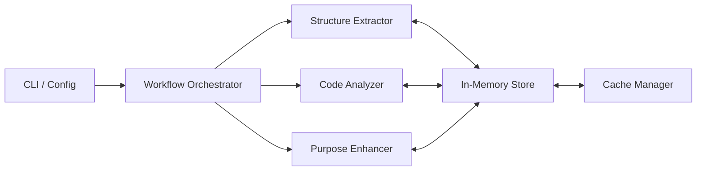

<div align="center">

# 🌳 CODE-TREE-RS

**A lightweight, high-performance code tree generator and intelligent static analysis tool.**

[](https://www.rust-lang.org)
[](LICENSE)
[]()
[](https://github.com/yourusername/code-tree-rs/pulls)

---

[**Features**](#-features) • [**Supported Languages**](#-supported-languages) • [**Quick Start**](#-quick-start) • [**Architecture**](#-architecture) • [**Documentation**](./Architecture.md)

</div>

## 📖 Overview

**code-tree-rs** is a powerful developer productivity tool designed for deep filesystem scanning and intelligent analysis of large codebases. It goes beyond a simple `tree` command by extracting architectural insights, semantic purposes, and code complexity metrics, providing a comprehensive "dossier" for your project.

Built with **Rust** for maximum performance and safety, it uses an asynchronous, parallel-processing pipeline to analyze even the largest repositories in seconds.

---

## ✨ Features

- 🏗️ **Architecture Extraction**  
  Automatically maps your project structure, including file distribution, types, and sizing statistics.
- 🧠 **Intelligent Code Insights**  
  Generates a detailed `CodeDossier` for each component, capturing interfaces, public APIs, and internal dependencies.
- 🏷️ **Semantic Classification**  
  Uses smart heuristics to identify the logical role of files (e.g., _Controller_, _Service_, _Widget_, _Database_).
- ⚡ **High-Performance Execution**  
  Leverages `Tokio` for parallel scanning and built-in caching for near-instant re-runs.
- 🛠️ **Highly Configurable**  
  Fine-tune scanning logic via `.tree.toml` with support for deep filtering and exclusion rules.

---

## 🌐 Supported Languages

`code-tree-rs` features a modular language processor system supporting a wide range of modern stacks:

|               |                   |                   |              |
| :------------ | :---------------- | :---------------- | :----------- |
| 🦀 **Rust**   | 🟦 **TypeScript** | 🟨 **JavaScript** | ⚛️ **React** |
| 🐍 **Python** | ☕ **Java**       | 🐘 **PHP**        | 🔷 **C#**    |
| 🛡️ **Kotlin** | 🕊️ **Swift**      | 🟠 **Svelte**     | 🟢 **Vue**   |

---

## 🚀 Quick Start

### 1. Installation

**Option A: Automated Install (Windows)**

Run the following command in PowerShell to automatically download the latest binary, install it to `$HOME\.code-tree-rs\bin`, and add it to your `PATH`:

```powershell
irm https://raw.githubusercontent.com/nimblemo/code-tree-rs/main/scripts/install.ps1 | iex
```

_Or, if you have the repository cloned:_

```powershell
    .\scripts\install.ps1
```

**Option B: Local Installation**

To download the binary into your current folder without changing the system `PATH`:

```powershell
& ([scriptblock]::Create((irm 'https://raw.githubusercontent.com/nimblemo/code-tree-rs/main/scripts/install.ps1'))) -Local
```

**Option C: Build from Source**

Ensure you have [Cargo](https://doc.rust-lang.org/cargo/getting-started/installation.html) installed:

```bash
git clone https://github.com/nimblemo/code-tree-rs.git
cd code-tree-rs
cargo build --release
```

### 2. Usage

Run the tool on your project:

```bash
./target/release/code-tree-rs --project-path /path/to/your/project
```

The results will be generated in the `.tree.docs` directory.

---

## 🏗️ Architecture

The tool follows a modular, agent-based architecture:



For a deep dive into the system design, check out our [**Architecture Documentation**](./Architecture.md).

---

## ⚙️ Configuration

Create a `.tree.toml` in your project root to customize behavior:

```toml
[general]
max_depth = 10
exclude_dirs = ["node_modules", "target", ".git"]

[cache]
enabled = true
dir = ".tree/cache"
```

---

<div align="center">

Made with ❤️ for the Developer Community

</div>
